# TinyOL-HITL

**Tiny** Online Learning with **Human-in-the-Loop** for Industrial Condition Monitoring

[](LICENSE)
[](core/)

## One-Liner

Deploy predictive maintenance on Day 1. No training data. No ML expertise. System learns faults as operators discover them.

## The Problem

```mermaid
graph LR
    A[27% PdM Adoption] --> B[Expertise Gap]
    A --> C[Vendor Lock-in]
    A --> D[Integration Cost]

    B --> E[TinyOL-HITL]
    C --> E
    D --> E

    E --> F[Deploy Immediately<br/>K=1 → K=N]
```



## How It Works

```mermaid
stateDiagram-v2
    [*] --> NORMAL: K=1 baseline
    NORMAL --> FROZEN: Outlier detected
    FROZEN --> NORMAL: Operator labels → K++
    FROZEN --> NORMAL: Operator discards
```



1. **Day 1:** Everything = "normal" (K=1)
2. **Fault occurs:** Device freezes, alarms SCADA
3. **Operator inspects:** Labels fault type
4. **System learns:** K=2, correct predictions next time

## Quick Start

```bash
# 1. Clone
git clone https://github.com/leekaize/tinyol-hitl.git
cd tinyol-hitl

# 2. Configure
cp core/config.template.h core/config.h
# Edit WiFi credentials

# 3. Upload (Arduino IDE)
# Board: ESP32 Dev Module or Raspberry Pi Pico 2 W
# Open: core/core.ino
# Upload

# 4. Wire sensor
# ADXL345/MPU6050 → I2C (SDA=21, SCL=22 for ESP32)
```

## API (9 functions)

```c
// Core
kmeans_init(&model, 3, 0.2f);
int8_t cluster = kmeans_update(&model, features);
kmeans_add_cluster(&model, "fault_name");

// Persistence (NEW)
storage.begin();
storage.load(&model);   // On startup
storage.save(&model);   // After add_cluster
storage.clear();        // On reset command
```

See [docs/API.md](docs/API.md) for complete reference.


## Architecture


## Persistent Storage (NEW)

Trained clusters survive power cycles.

```mermaid
flowchart LR
    A[Label Fault] --> B[K++]
    B --> C[💾 Save to Flash]
    C --> D[Power Off]
    D --> E[Power On]
    E --> F[Load from Flash]
    F --> G[Resume K clusters]
```



**When saves happen:** Immediately after each new cluster

**Reset model:** `mosquitto_pub -t "tinyol/{device_id}/reset" -m '{"reset":true}'`

**Platform storage:**
- ESP32: NVS (Preferences library)
- RP2350: LittleFS


## Memory Footprint

| Component | Size |
|-----------|------|
| Clusters (16 max) | 1.0 KB |
| Ring buffer (100 samples) | 1.2 KB |
| Metadata | 0.3 KB |
| **Total** | **2.5 KB** |

## Validation

| Dataset | Method |
|---------|--------|
| CWRU Bearing | 4 fault classes, streaming via Serial |
| Real Motor | 0.5HP 3-phase, eccentric weight faults |

**TO-DO:** Actual benchmark results in progress. See [docs/SPRINT_2DAY.md](docs/SPRINT_2DAY.md).

## Project Structure

```
core/                    # Arduino sketch
├── core.ino             # Main loop
├── streaming_kmeans.c   # Algorithm (200 lines)
└── config.template.h    # WiFi/MQTT settings

docs/
├── presentation/        # sli.dev slides
├── API.md              # Function reference
└── SPRINT_2DAY.md      # Current sprint

data/datasets/cwru/      # Benchmark dataset pipeline
integrations/            # FUXA SCADA setup
```

## Presentation

```bash
cd docs/presentation
npm init slidev@latest
npm run dev
# http://localhost:3030
```

## License

Apache-2.0

## Citation

```bibtex
@misc{tinyol-hitl2025,
  author = {Lee, Kai Ze},
  title = {TinyOL-HITL: Unsupervised TinyML Fault Discovery},
  year = {2025},
  publisher = {GitHub},
  url = {https://github.com/leekaize/tinyol-hitl}
}
```