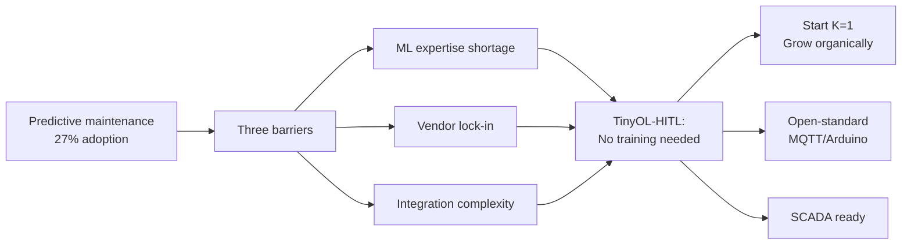
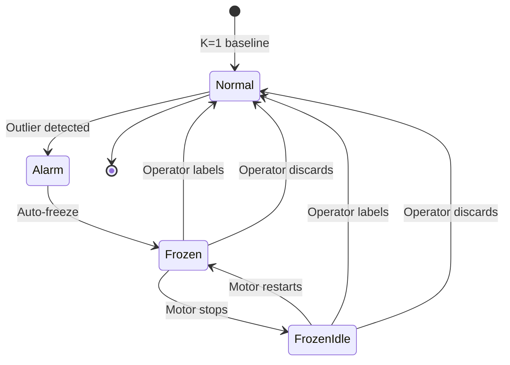

# TinyOL-HITL: Unsupervised TinyML Fault Discovery with Operator Guidance for Industrial Condition Monitoring

[](LICENSE)
[](core/)
[](https://github.com/leekaize/tinyol-hitl/actions/workflows/test-core.yml)

## Problem

Predictive maintenance stuck at 27% adoption. Three barriers:
- ML expertise shortage
- Vendor lock-in
- Integration complexity

## Solution

Start with K=1. Device learns automatically. Operator labels outliers only.

- **Day 1:** K=1, everything = "normal"
- **Week 1:** Anomaly detected → operator inspects → labels "bearing_fault" → K=2
- **Month 1:** System discovers 4 fault types organically

Arduino library. Any board (ESP32, RP2350). MQTT to FUXA SCADA. <1KB memory.



## Quick Start

**1. Install Arduino IDE** (5 min)
```bash
# Download: https://www.arduino.cc/en/software
# File → Preferences → Board URLs:
https://espressif.github.io/arduino-esp32/package_esp32_index.json,
https://github.com/earlephilhower/arduino-pico/releases/download/global/package_rp2040_index.json

# Tools → Board Manager: Install "esp32" and "Raspberry Pi Pico/RP2040/RP2350"
# Tools → Manage Libraries: Install "PubSubClient", "ArduinoJson", "Adafruit ADXL345"
```

**2. Upload sketch** (2 min)
```bash
# File → Open → core/core.ino
# Copy config.template.h to config.h
# Edit WiFi credentials in config.h
# Tools → Board: ESP32S3 Dev Module (or Raspberry Pi Pico 2 W)
# Tools → Port: /dev/ttyUSB0
# Sketch → Upload
```

**3. Wire sensor** (3 min)
```
ADXL345 → ESP32-S3
VCC     → 3.3V
GND     → GND
SDA     → GPIO21
SCL     → GPIO22
```

**4. Run FUXA SCADA** (1 min)
```bash
# On Raspberry Pi or any Docker host
docker run -d \
  -p 1881:1881 \
  -v fuxa_appdata:/usr/src/app/FUXA/server/_appdata \
  -v fuxa_db:/usr/src/app/FUXA/server/_db \
  frangoteam/fuxa:latest

# Access: http://<host-ip>:1881
```

**5. Connect MQTT** (1 min)
```bash
# Run Mosquitto
docker run -d -p 1883:1883 --name mosquitto eclipse-mosquitto

# Device publishes to: sensor/device1/data
# Operator labels via: tinyol/device1/label
```

## Workflow



## How It Works

```mermaid
sequenceDiagram
    participant Device
    participant Buffer
    participant Operator
    participant SCADA

    Note over Device: Day 1: Everything = "normal"
    Device->>Buffer: Collect samples (10 Hz)
    Buffer->>Device: Check: outlier?

    Note over Device: Outlier detected!
    Device->>SCADA: 🔴 ALARM
    Device->>Buffer: FREEZE

    Note over Operator: Inspect motor physically
    Operator->>SCADA: Label: "bearing_fault"
    SCADA->>Device: Create cluster

    Note over Device: K = 1 → 2
    Device->>Buffer: Resume sampling
```



**Unsupervised learning:** Device clusters vibration patterns automatically. No training needed.

**Operator guidance:** When outlier detected → alarm freezes → operator inspects physically → labels → device retrains.

**Idle detection:** Alarm persists after motor stops. Operator labels during scheduled downtime, not emergency response.

**Feature extraction (3D):**
- **RMS**: Overall vibration energy
- **Peak**: Maximum amplitude
- **Crest Factor**: Peak/RMS ratio (bearing faults spike)

**Streaming k-means with EMA:**
```
c_new = c_old + α(x - c_old)
α = base_lr / (1 + 0.01 × count)
```

**States:**
```
NORMAL → outlier → FROZEN → motor stops → FROZEN_IDLE
FROZEN_IDLE → label → NORMAL (resume monitoring)
```

**Memory:** <2.5KB model + buffer. Sub-millisecond inference.

## Validation

- **CWRU dataset:** 1904 samples, 4 fault classes, streaming @ 115200 baud
- **Hardware:** 2 HP motor, ADXL345/MPU6050, ESP32/RP2350
- **SCADA:** FUXA via MQTT
- **Test method:** Eccentric weight unbalance (non-destructive)

Results: In progress

## Supported Platforms

| Board | Arch | RAM | Speed | WiFi |
|-------|------|-----|-------|------|
| ESP32 DEVKIT V1 | Xtensa LX6 | 520KB | 240MHz | ✓ |
| RP2350 (Pico 2 W) | ARM Cortex-M33 | 520KB | 150MHz | ✓ |

Same code compiles for both. Arduino IDE removes platform complexity.

## Project Structure

```
core/                   # Arduino sketch
├── core.ino            # Main loop (sensor → cluster → MQTT)
├── streaming_kmeans.c  # Unsupervised clustering
├── streaming_kmeans.h  # API
└── config.h            # WiFi + MQTT settings

data/datasets/cwru/     # CWRU bearing dataset
integrations/           # FUXA SCADA setup guide
docs/                   # Architecture, task list
```

## Cost Analysis

| Component | Cost |
|-----------|------|
| ESP32-S3 or RP2350 | RM30 |
| ADXL345 sensor | RM20 |
| Enclosure (IP65) | RM20 |
| Cables + mounting | RM10 |
| **Total** | **RM80** |

Compare: Commercial gateway (RM300-800) + cloud fees (RM50-200/month).

Breakeven: <2 months. Zero recurring fees.

## Documentation

- [docs/ARCHITECTURE.md](docs/ARCHITECTURE.md) - System design
- [docs/DATASETS.md](docs/DATASETS.md) - CWRU workflow
- [integrations/README.md](integrations/README.md) - FUXA setup
- [docs/TASK_LIST.md](docs/TASK_LIST.md) - 7-day sprint

## Contributing

See [CONTRIBUTING.md](CONTRIBUTING.md).

## License

Apache-2.0. Industrial-friendly. Fork freely.

---

**Target audience:** SMEs, embedded engineers, maintenance teams
**Deployment time:** 30 minutes first device, 10 minutes subsequent
**Proven on:** CWRU dataset + 2 HP induction motor