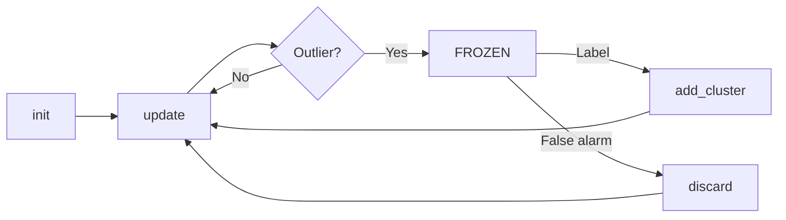
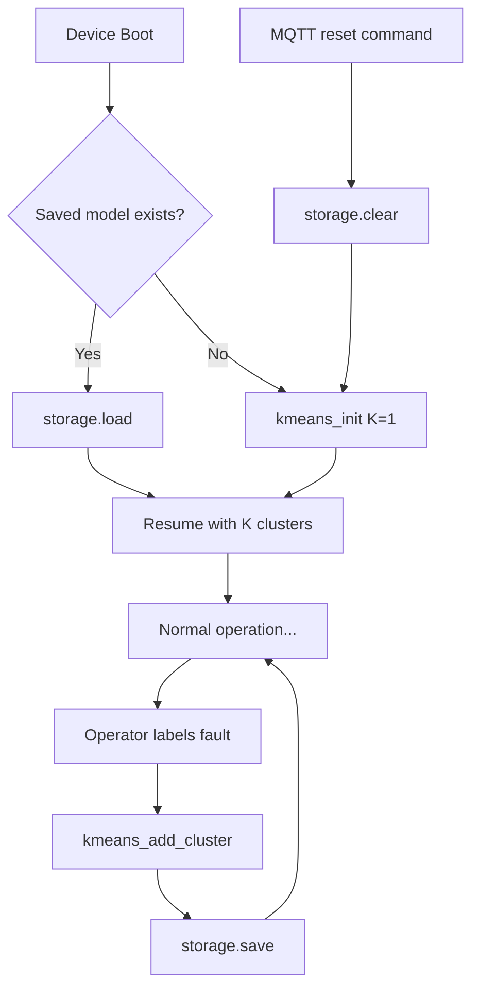

# TinyOL-HITL API Reference

8 functions. 2.5KB memory. Zero dependencies.

## Core Workflow



## Function Reference

### 1. `kmeans_init`
Initialize model with K=1 ("normal" baseline).

```c
bool kmeans_init(kmeans_model_t* model, uint8_t feature_dim, float learning_rate);
```

| Param | Type | Description |
|-------|------|-------------|
| model | kmeans_model_t* | Model struct |
| feature_dim | uint8_t | Features per sample (3 for vibration) |
| learning_rate | float | EMA rate (0.1-0.3 typical) |

**Returns:** `true` if successful

---

### 2. `kmeans_update`
Stream one sample. Auto-detects outliers.

```c
int8_t kmeans_update(kmeans_model_t* model, const fixed_t* point);
```

| Param | Type | Description |
|-------|------|-------------|
| model | kmeans_model_t* | Model struct |
| point | fixed_t* | Feature array (Q16.16 fixed-point) |

**Returns:**
- `0` to `k-1`: Assigned cluster ID
- `-1`: Outlier detected → model is FROZEN

---

### 3. `kmeans_add_cluster`
Create new cluster from frozen buffer. Called after operator labels.

```c
bool kmeans_add_cluster(kmeans_model_t* model, const char* label);
```

| Param | Type | Description |
|-------|------|-------------|
| model | kmeans_model_t* | Model (must be FROZEN) |
| label | const char* | Fault name from operator |

**Returns:** `true` if cluster created, `false` if failed

**Side effect:** Resumes NORMAL state, K++

---

### 4. `kmeans_discard`
Clear frozen buffer (false alarm). Resume without creating cluster.

```c
void kmeans_discard(kmeans_model_t* model);
```

---

### 5. `kmeans_predict`
Classify without updating centroids.

```c
uint8_t kmeans_predict(const kmeans_model_t* model, const fixed_t* point);
```

**Returns:** Nearest cluster ID (0 to k-1)

---

### 6. `kmeans_get_state`
Check current state machine position.

```c
system_state_t kmeans_get_state(const kmeans_model_t* model);
```

**Returns:**
- `STATE_NORMAL`: Sampling active
- `STATE_FROZEN`: Outlier detected, waiting for label
- `STATE_FROZEN_IDLE`: Motor stopped, alarm persists

---

### 7. `kmeans_get_label`
Retrieve cluster name.

```c
bool kmeans_get_label(const kmeans_model_t* model, uint8_t cluster_id, char* label);
```

---

### 8. `kmeans_correct`
Manually reassign sample (operator correction).

```c
bool kmeans_correct(kmeans_model_t* model, const fixed_t* point,
                    uint8_t old_cluster, uint8_t new_cluster);
```

---

## Fixed-Point Conversion

```c
// Float → Fixed (Q16.16)
fixed_t value = FLOAT_TO_FIXED(0.5f);  // → 32768

// Fixed → Float
float f = FIXED_TO_FLOAT(value);       // → 0.5
```

---

## Minimal Example

```c
#include "streaming_kmeans.h"

kmeans_model_t model;

void setup() {
    kmeans_init(&model, 3, 0.2f);  // 3 features, lr=0.2
}

void loop() {
    // Read sensor
    float ax, ay, az;
    readAccelerometer(&ax, &ay, &az);

    // Extract features
    fixed_t features[3] = {
        FLOAT_TO_FIXED(sqrt(ax*ax + ay*ay + az*az)),  // RMS
        FLOAT_TO_FIXED(max(abs(ax), max(abs(ay), abs(az)))),  // Peak
        FLOAT_TO_FIXED(peak / rms)  // Crest
    };

    // Update model
    int8_t cluster = kmeans_update(&model, features);

    if (cluster == -1) {
        // FROZEN - wait for MQTT label
        // kmeans_add_cluster(&model, "fault_name");
    }
}
```

---

## MQTT Topics

| Topic | Direction | Purpose |
|-------|-----------|---------|
| `sensor/{id}/data` | Device → SCADA | Summary every 10s |
| `tinyol/{id}/label` | SCADA → Device | Create cluster |
| `tinyol/{id}/discard` | SCADA → Device | Clear buffer |

### Label payload
```json
{"label": "bearing_outer_race"}
```

### Discard payload
```json
{"discard": true}
```

---

## Storage API (Persistence)

Model survives power cycles via flash storage.

### Storage Workflow



---

### `storage.begin()`
Initialize flash storage subsystem.

```c
ModelStorage storage;
storage.begin();  // Call once in setup()
```

**Returns:** `true` if successful

---

### `storage.save()`
Save model to flash. Call after `kmeans_add_cluster()`.

```c
if (kmeans_add_cluster(&model, "fault_name")) {
    storage.save(&model);  // Persist immediately
}
```

**Returns:** `true` if successful

---

### `storage.load()`
Load saved model from flash.

```c
// In setup(), after kmeans_init():
if (storage.hasModel()) {
    storage.load(&model);  // Overwrites default K=1
}
```

**Returns:** `true` if valid model loaded

---

### `storage.hasModel()`
Check if valid saved model exists.

```c
if (storage.hasModel()) {
    Serial.println("Found saved model");
}
```

**Returns:** `true` if valid model in storage

---

### `storage.clear()`
Erase saved model. Used by reset command.

```c
// MQTT reset handler:
if (doc["reset"] == true) {
    storage.clear();
    kmeans_reset(&model);
}
```

---

### Complete Example

```c
#include "model_storage.h"

kmeans_model_t model;
ModelStorage storage;

void setup() {
    storage.begin();
    kmeans_init(&model, 3, 0.2f);

    // Try to restore saved model
    if (storage.hasModel()) {
        storage.load(&model);
        Serial.printf("Restored K=%d\n", model.k);
    }
}

void onLabel(const char* label) {
    if (kmeans_add_cluster(&model, label)) {
        storage.save(&model);  // Persist!
    }
}

void onReset() {
    storage.clear();
    kmeans_reset(&model);
}
```

---

### Storage Format

| Field | Size | Description |
|-------|------|-------------|
| Magic | 4 bytes | `0x544F4C48` ("TOLH") |
| Version | 1 byte | Format version |
| K | 1 byte | Number of clusters |
| Feature dim | 1 byte | Features per sample |
| Reserved | 1 byte | Future use |
| Total points | 4 bytes | Cumulative training count |
| Threshold | 4 bytes | Outlier threshold |
| Learning rate | 4 bytes | EMA rate |
| Clusters | Variable | K × cluster data |

Per-cluster: centroid (D×4 bytes) + count (4) + inertia (4) + label (32) + active (1)

**Total for K=4, D=7:** ~500 bytes