# Architecture

Label-driven clustering. Device learns automatically. Operator labels outliers only.

## State Machine

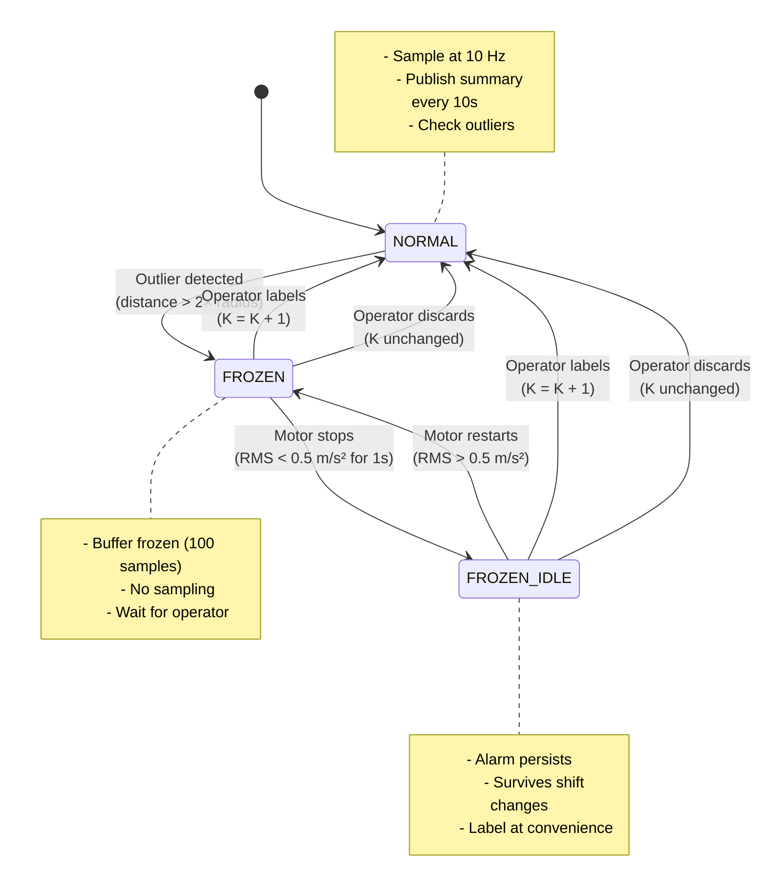

## Data Flow

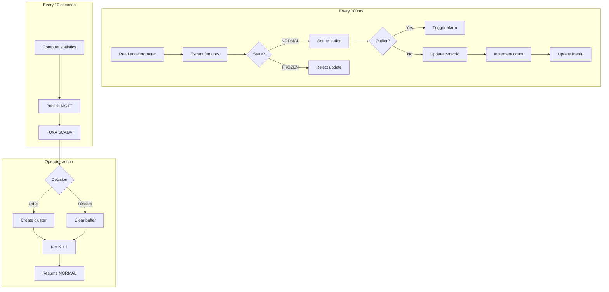

## Feature Extraction

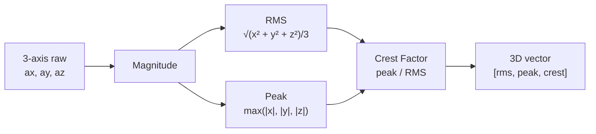

**Window:** 100 samples = 10 seconds @ 10 Hz

**Why these features:**
- RMS: Overall vibration energy
- Peak: Maximum amplitude (bearing impacts spike)
- Crest: Impulsiveness indicator (>2.5 = fault)

## Clustering Algorithm

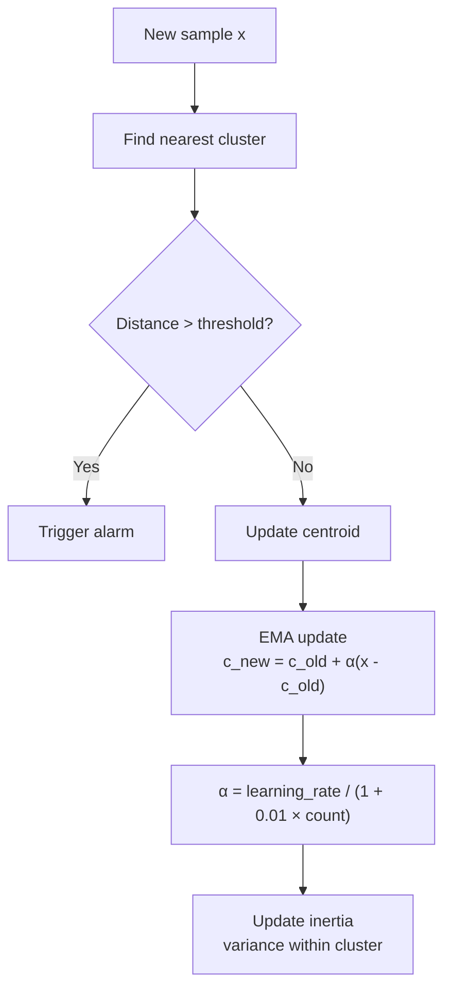

**Update rule:**
```
α = base_lr / (1 + 0.01 × count)
c_new = c_old + α(x - c_old)
```

Learning rate decays as cluster matures.

## Outlier Detection

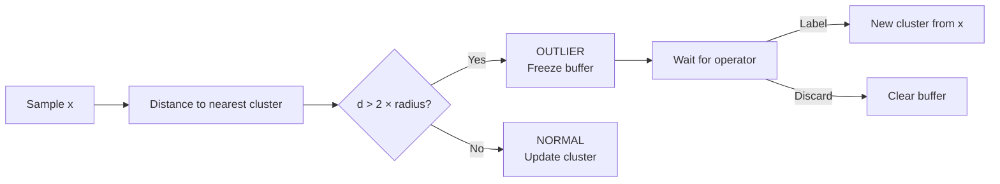

**Threshold:** 2.0× cluster radius (adjustable 1.5-5.0)

## Idle Detection

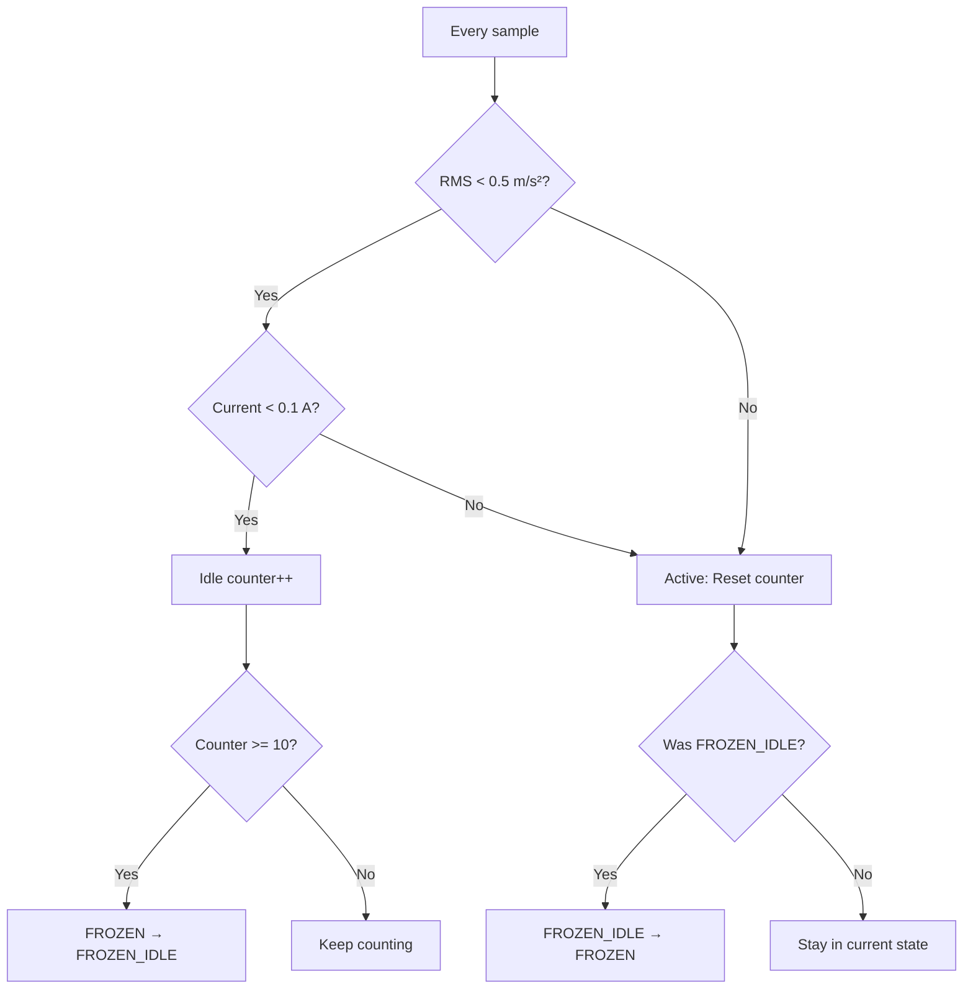

**Purpose:** Alarm persists after motor stops. Operator labels during scheduled downtime.

## MQTT Schema

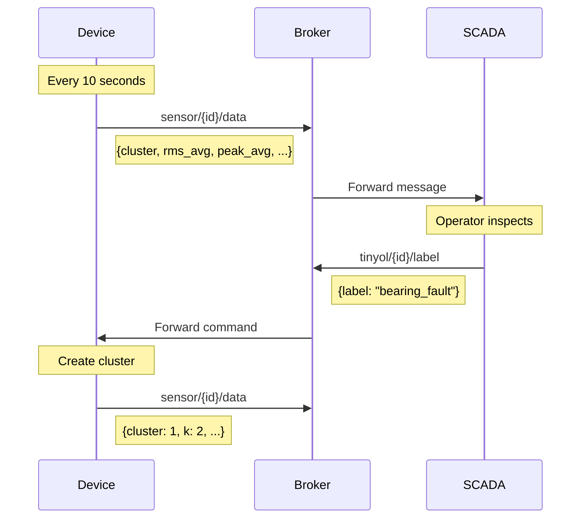

**Topics:**
- `sensor/{id}/data` - Summary (device → SCADA)
- `tinyol/{id}/label` - Create cluster (SCADA → device)
- `tinyol/{id}/discard` - Clear buffer (SCADA → device)

## JSON Format

**Normal summary:**
```json
{
  "device_id": "tinyol_device1",
  "cluster": 0,
  "label": "normal",
  "k": 1,
  "alarm_active": false,
  "frozen": false,
  "idle": false,
  "rms_avg": 5.2,
  "rms_max": 6.1,
  "peak_avg": 9.1,
  "peak_max": 11.2,
  "crest_avg": 1.75,
  "buffer_samples": 0
}
```

**Alarm state:**
```json
{
  "alarm_active": true,
  "frozen": true,
  "cluster": -1,
  "label": "unknown",
  "buffer_samples": 100
}
```

**Idle state:**
```json
{
  "alarm_active": true,
  "frozen": true,
  "idle": true,
  "rms_avg": 0.3
}
```

## Memory Layout

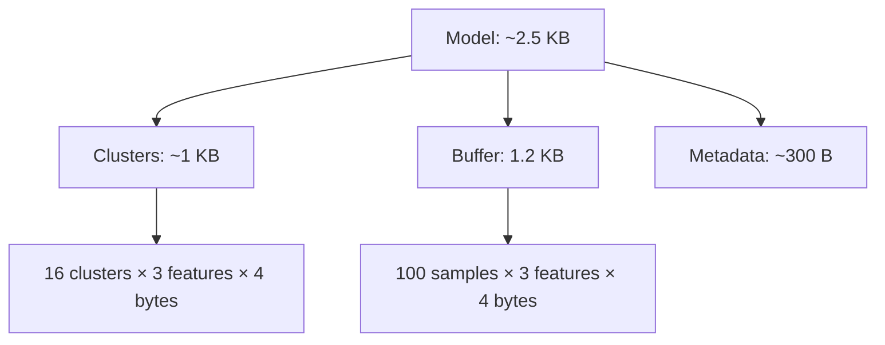

**Breakdown:**
- Clusters: K × D × 4 bytes (max 16 × 64 = 4.2 KB)
- Buffer: 100 × D × 4 bytes (100 × 3 = 1.2 KB)
- Total: <2.5 KB for typical config

## Decision Tree

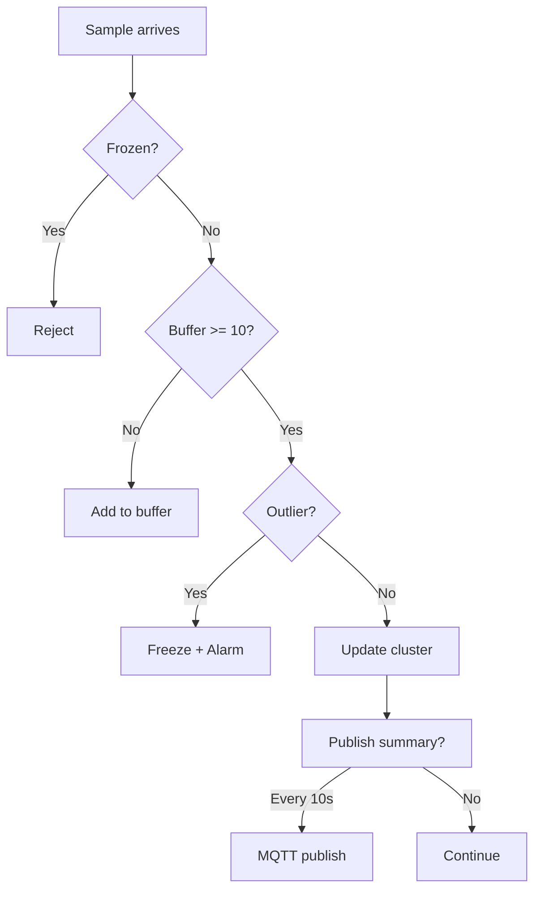

## Platform Abstraction

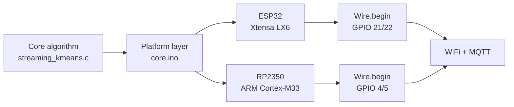

**Same algorithm, different I/O.**

## Performance

| Metric | Value |
|--------|-------|
| Loop latency | <20 ms |
| Feature extraction | 0.08 ms |
| Outlier check | 0.28 ms |
| MQTT publish | 10-15 ms |
| Memory | 2.5 KB |
| Traffic | 9 KB/hour |

## Operator Workflow

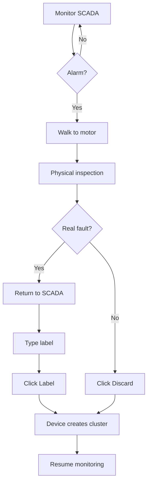

**Key insight:** No timeout. Operator has unlimited time.

## Why This Works

**Traditional approach:**
1. Collect months of data
2. Label every sample
3. Train model
4. Deploy
5. Model is frozen

**TinyOL-HITL:**
1. Deploy K=1
2. Discover fault
3. Operator labels
4. K grows
5. Model adapts

**Result:** Days to deployment vs months.