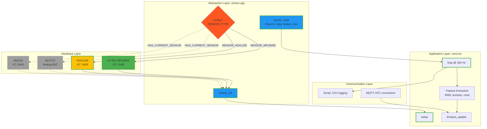

# Architecture

System design for multi-platform on-device learning with human corrections.

## Core Algorithm

**Streaming k-means.** Exponential moving average. No batch processing. Update per sample.

**Update rule:**
```
centroid_new = centroid_old + α(sample - centroid_old)
α = base_lr / (1 + 0.01 × count)
```

Learning rate decays as cluster sees more points. Prevents drift from established patterns.

**Memory:** K × D × 4 bytes + metadata. Example: 10 clusters × 32 features = 1.28 KB.

**Precision:** Q16.16 fixed-point. ARM, Xtensa, AVR all have 32-bit multiply.

**Distance:** Squared Euclidean. No sqrt. Saves 30% compute per sample.

## Platform Requirements

**Minimum:**
- 520 KB RAM (ESP32/RP2350 both meet this)
- WiFi capability (both platforms native)
- Arduino IDE support

**Static allocation only.** No malloc. Deterministic memory. Predictable behavior.

**Cluster count:** Fixed at compile time. Trade flexibility for safety.

## Platform Abstraction

**Core API:**
```cpp
void platform_init();           // WiFi, LED, storage
void platform_loop();           // Reconnect logic
void platform_blink(uint8_t n); // Visual feedback
```

Three functions. Core algorithm stays pure. Platform handles I/O.

**ESP32 specifics:**
- WiFi native, NVS storage
- FreeRTOS (unused in MVP)

**RP2350 specifics:**
- WiFi via CYW43, LittleFS storage
- Dual-core ARM (unused in MVP)

## Data Flow

**Inference path:**
```
Sensor → ADC → Feature → K-means → Cluster ID → MQTT/Serial → SCADA
```

**Training path:**
```
SCADA → Human Label → MQTT → Update Centroid → Flash → Persist
```

**Flash write trigger:** Every 100 samples or on label correction. Balance persistence vs wear.

## Communication Protocol

**MQTT topics (WiFi platforms):**
```
sensor/device_id/data          # Streaming features
sensor/device_id/cluster       # Assigned cluster
sensor/device_id/correction    # Human label (subscribe)
sensor/device_id/model         # Centroid updates (publish on change)
```

**Serial protocol (non-WiFi):**
```
> CLUSTER:2,FEATURES:[0.32,-0.15,0.08]\n
< CORRECTION:2,LABEL:bearing_fault\n
```

**QoS:** 0 for data stream, 1 for corrections.

## Human-in-the-Loop Corrections

### MQTT Message Format
Topic: `tinyol/{device_id}/correction`
Payload:
```json
{
  "cluster_id": 2,
  "label": "bearing_outer_race",
  "correction_type": "relabel",
  "timestamp": 1699142400,
  "operator_id": "tech_042"
}
```

### Correction Processing
1. Subscribe to correction topic on boot
2. Parse JSON (ArduinoJson library)
3. Update centroid via reverse EMA
4. Persist to NVS/LittleFS
5. Publish ACK to `tinyol/{device_id}/ack`

### Implementation Status
- [x] Message format defined
- [ ] MQTT callback handler (Week 2)
- [ ] Centroid update logic (Week 2)
- [ ] Flash persistence (Week 2)

## Integration Architecture
```
MCU → WiFi/Serial → MQTT Broker/Serial Monitor → supOS-CE/RapidSCADA → Web HMI
                                                      ↓
                                                 PostgreSQL (label history)
                                                      ↑
                                                 Analytics (Python)
```

**supOS-CE:** Unified namespace. Tag-based routing. MQTT native.

**RapidSCADA:** Modbus RTU/TCP. OPC-UA. Open-source. Windows/Linux.

**Choice:** supOS for pure MQTT. RapidSCADA for legacy Modbus infrastructure.

## Multi-Sensor Architecture



## Performance Targets

**Latency:**
- Sample → Cluster: <50 ms
- Label → Update: <2 s (WiFi), <5 s (Serial)
- WiFi transmit: 1 Hz

**Throughput:**
- ESP32: 200 samples/sec @ 240 MHz
- RP2350: 150 samples/sec @ 150 MHz

**Power:**
- ESP32: 45 mA active, 10 µA sleep
- RP2350: 35 mA active, 0.8 mA sleep

## Memory Layout

**ESP32 (520 KB SRAM):**
```
0x00000 - 0x14000: FreeRTOS kernel + WiFi (80 KB)
0x14000 - 0x15400: K-means model (5 KB)
0x15400 - 0x27000: Training buffer (71 KB)
0x27000 - 0x80000: Heap (364 KB margin)
```

**RP2350 (520 KB SRAM):**
```
0x20000000 - 0x20014000: WiFi (CYW43) firmware (80 KB)
0x20014000 - 0x20015400: K-means model (5 KB)
0x20015400 - 0x20080000: Unused (435 KB margin)
```

## Dataset Integration

**CWRU streaming:**
- Source: 12 kHz accelerometer data
- Format: .mat files → fixed-point binary
- Chunk: 256 samples per packet
- Interface: SD card or UART

**Validation:**
- Hardware: Real motor + sensor (ESP32/RP2350)
- Dataset: CWRU/MFPT (all platforms via Serial)
- Metrics: Confusion matrix, accuracy, F1 score

## Algorithm Decisions

**Why streaming k-means?**
- Simplest unsupervised algorithm (200 lines C)
- Lowest memory (linear in K and D)
- Proven convergence (Bottou 1998)

**Why not neural networks?**
- Backprop memory overhead (gradients)
- Convergence requires batch

**Why not GMM?**
- Covariance matrices: O(D²) memory
- EM algorithm needs batch iteration
- Computational cost too high

**Why fixed-point?**
- No FPU on Cortex-M33 (RP2350)
- ESP32 has FPU, but fixed-point is portable
- 16.16 format sufficient for condition monitoring

## Open Questions

**Feature extraction:** Time domain (RMS, kurtosis) or frequency domain (FFT)? Test both. Measure accuracy vs compute.

**Label conflicts:** Human says A, model says B. Strategy: trust human, decay old centroid slowly (α = 0.05).

**Flash wear:** 100k write cycles typical. At 100 samples/write, that's 10M samples. Acceptable for research.

## Future Extensions

**Neural augmentation:** Add 1-layer perceptron after k-means. Optional compilation flag.

**Multi-sensor fusion:** Vibration + temperature + current. Extend feature dimension.

**OTA updates:** Flash new model via MQTT (ESP32/RP2350 only).

**Energy harvesting:** Solar or vibration. Battery becomes backup, not primary.