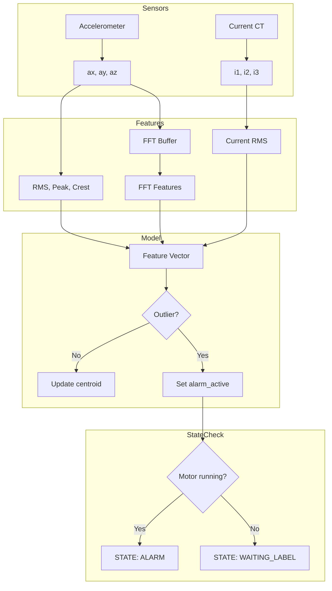
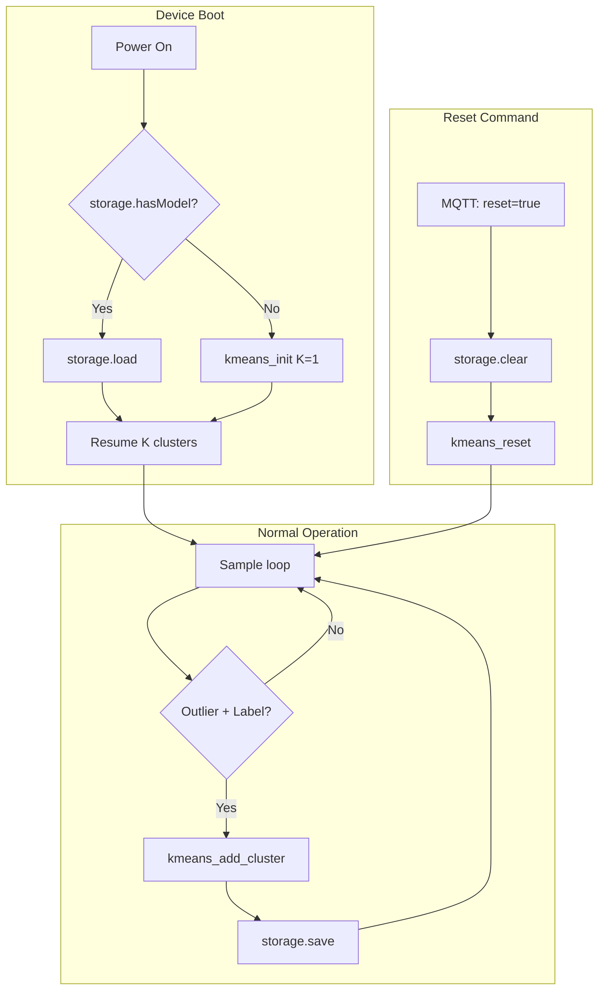
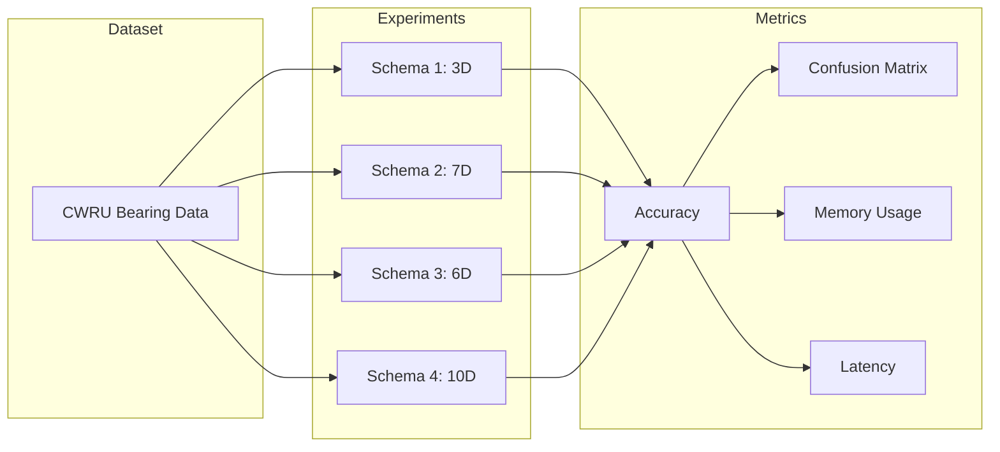

# Architecture

Label-driven clustering with proper alarm/freeze semantics.

## State Machine

```mermaid
stateDiagram-v2
    [*] --> NORMAL: Initialize K=1

    NORMAL --> ALARM: Outlier detected
    note right of NORMAL: Sampling active<br/>Green status

    ALARM --> NORMAL: 3s normal streak
    note right of ALARM: Motor running<br/>Red banner<br/>Still sampling

    ALARM --> WAITING_LABEL: Motor stops
    ALARM --> WAITING_LABEL: Button pressed

    WAITING_LABEL --> NORMAL: Label → K++
    WAITING_LABEL --> NORMAL: Discard
    WAITING_LABEL --> ALARM: Motor restarts
    note right of WAITING_LABEL: Frozen<br/>Ready for input
```



**Key insight:** Alarm doesn't freeze sampling. Motor-stop or button-press does.

## Comparison: Vibration-Only vs Combined

| Schema | Features | Dimension | Use Case |
|--------|----------|-----------|----------|
| TIME_ONLY | rms, peak, crest | 3D | Minimal setup |
| TIME_CURRENT | + i1, i2, i3, i_rms | 7D | Motor diagnosis |
| FFT_ONLY | + freq, amp, centroid | 6D | Better fault ID |
| FFT_CURRENT | All above | 10D | Full analysis |

Research validates each schema separately against CWRU baseline.

## Data Flow



## Alarm Logic

```mermaid
flowchart TD
    A[New sample] --> B{STATE?}

    B -->|NORMAL| C{Outlier?}
    C -->|No| D[Update centroid]
    C -->|Yes| E[alarm_active = true]
    E --> F[STATE → ALARM]

    B -->|ALARM| G{Outlier?}
    G -->|Yes| H[Keep ALARM]
    G -->|No| I[normal_streak++]
    I --> J{streak >= 30?}
    J -->|Yes| K[STATE → NORMAL<br/>alarm_active = false]
    J -->|No| H

    H --> L{Motor running?}
    L -->|No| M[STATE → WAITING_LABEL<br/>waiting_label = true]
    L -->|Yes| N[Stay in ALARM]

    B -->|WAITING_LABEL| O[Reject update]
```



## Motor Detection

```mermaid
flowchart LR
    A[Every sample] --> B{RMS < 0.5?}
    B -->|Yes| C{Current < 0.1?}
    B -->|No| D[motor_running = true]

    C -->|Yes| E[idle_count++]
    C -->|No| D

    E --> F{count >= 10?}
    F -->|Yes| G[motor_running = false]
    F -->|No| H[Keep counting]

    D --> I{Was WAITING_LABEL?}
    I -->|Yes| J[→ ALARM]
    I -->|No| K[Continue]
```



## Feature Schemas

### Schema 1: Time-Domain Only (3D)
```c
features[0] = sqrt((ax² + ay² + az²) / 3);  // RMS
features[1] = max(|ax|, |ay|, |az|);         // Peak
features[2] = peak / rms;                     // Crest
```

### Schema 2: Time + Current (7D)
```c
features[0-2] = [rms, peak, crest];
features[3-5] = [i1, i2, i3];
features[6]   = sqrt((i1² + i2² + i3²) / 3);  // i_rms
```

### Schema 3: Time + FFT (6D)
```c
features[0-2] = [rms, peak, crest];
features[3]   = fft_peak_frequency;   // Hz
features[4]   = fft_peak_amplitude;
features[5]   = spectral_centroid;    // Hz
```

### Schema 4: Full (10D)
```c
features[0-2] = [rms, peak, crest];
features[3-5] = [fft_freq, fft_amp, centroid];
features[6-8] = [i1, i2, i3];
features[9]   = i_rms;
```

## Memory Layout

```
kmeans_model_t (~3 KB)
├── clusters[16]          ~1.5 KB
│   └── centroid[64]      256 B each (max)
│   └── label[32]         32 B each
│   └── count, inertia    8 B each
├── buffer                ~1.2 KB
│   └── samples[100][10]  4000 B (max schema)
└── state vars            ~100 B
```

Actual usage depends on FEATURE_DIM:
- 3D: ~1.6 KB
- 7D: ~2.2 KB
- 10D: ~3.0 KB

## MQTT Topics

| Topic | Direction | Content |
|-------|-----------|---------|
| `sensor/{id}/data` | → SCADA | Summary every 10s |
| `tinyol/{id}/label` | ← SCADA | `{"label":"fault_name"}` |
| `tinyol/{id}/discard` | ← SCADA | `{"discard":true}` |
| `tinyol/{id}/freeze` | ← SCADA | `{"freeze":true}` |

## Operator Workflow

```mermaid
sequenceDiagram
    participant M as Motor
    participant D as Device
    participant S as SCADA
    participant O as Operator

    M->>D: Normal vibration
    D->>S: state: NORMAL

    Note over M: Fault develops

    M->>D: High vibration
    D->>D: Outlier detected
    D->>S: state: ALARM, alarm_active: true
    S->>O: 🔴 Red banner

    alt Motor keeps running
        O->>S: Click Freeze button
        S->>D: tinyol/{id}/freeze
        D->>S: state: WAITING_LABEL
    else Motor stops (shift change)
        M->>D: RMS → 0, Current → 0
        D->>D: motor_running = false
        D->>S: state: WAITING_LABEL
    end

    O->>O: Physical inspection
    O->>S: Label: "bearing_fault"
    S->>D: tinyol/{id}/label
    D->>D: K++ (K=2)
    D->>S: state: NORMAL, k: 2
```




## Persistent Storage

Model survives power cycles via flash storage.



### When Saves Happen

| Event | Action |
|-------|--------|
| New cluster created | `storage.save()` immediately |
| Power cycle | Load on boot |
| Reset command | `storage.clear()` |
| Firmware upload | Storage cleared (platform-dependent) |

### Storage Size

```
Header:           16 bytes
Per cluster:      ~80 bytes (centroid + metadata)
Total (K=16):     ~1.3 KB flash

ESP32 NVS:        4KB partition (plenty)
RP2350 LittleFS:  2MB flash (plenty)
```

### Platform Abstraction

```c
// Same API, different backends
class ModelStorage {
    bool begin();
    bool save(const kmeans_model_t* model);
    bool load(kmeans_model_t* model);
    bool hasModel();
    void clear();
};
```

| Platform | Backend | Notes |
|----------|---------|-------|
| ESP32 | NVS (Preferences) | Key-value store, wear-leveling built-in |
| RP2350 | LittleFS | File-based, single binary file |


## Research Comparison Design



Research question: **Does adding current sensing improve fault classification?**

Hypothesis: Combined features outperform vibration-only by 5-15%.