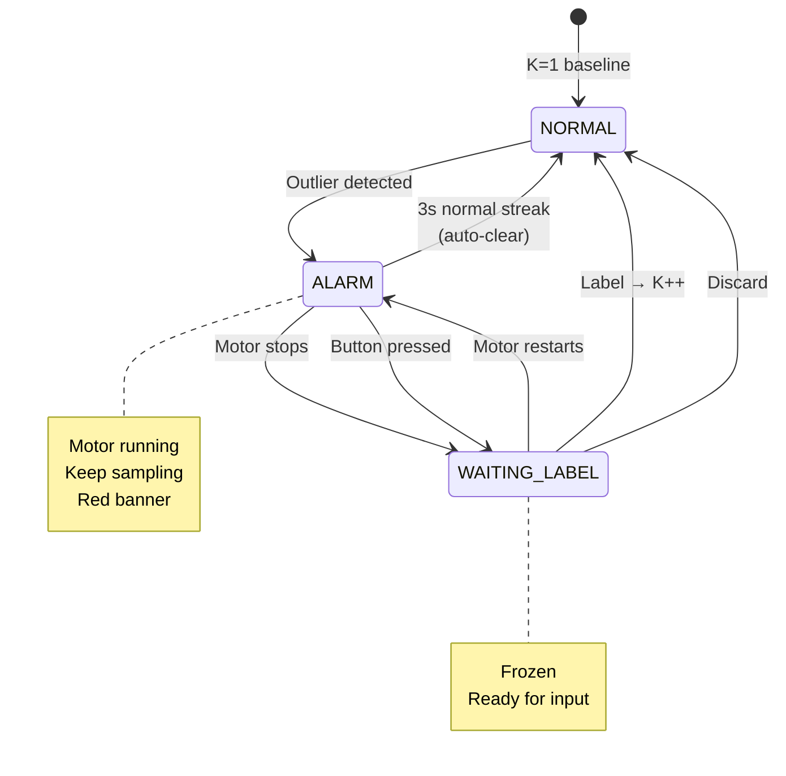
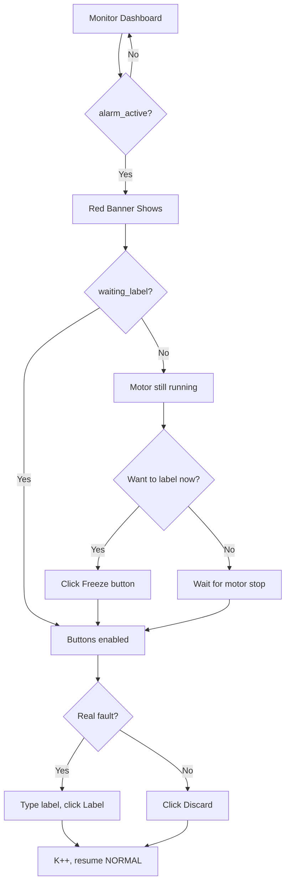

# MQTT JSON Schema v2

Flat JSON for SCADA compatibility. Updated state machine.

## State Machine



## Topic Structure

```
sensor/{device_id}/data          # Summary every 10s
tinyol/{device_id}/label         # Operator label
tinyol/{device_id}/discard       # Operator discard
tinyol/{device_id}/freeze        # Manual freeze button
```

---

## Data Message (Device → SCADA)

### NORMAL State
```json
{
  "device_id": "motor_01",
  "state": "NORMAL",
  "cluster": 0,
  "label": "normal",
  "k": 1,
  "alarm_active": false,
  "waiting_label": false,
  "motor_running": true,
  "sample_count": 100,
  "vib_rms_avg": 5.2,
  "vib_rms_max": 6.1,
  "vib_peak_avg": 9.1,
  "vib_crest_avg": 1.75,
  "current_rms_avg": 2.3,
  "buffer_samples": 0,
  "timestamp": 123456
}
```

### ALARM State (motor running, still sampling)
```json
{
  "device_id": "motor_01",
  "state": "ALARM",
  "cluster": -1,
  "label": "unknown",
  "k": 1,
  "alarm_active": true,
  "waiting_label": false,
  "motor_running": true,
  "sample_count": 100,
  "vib_rms_avg": 12.3,
  "vib_rms_max": 15.7,
  "buffer_samples": 0,
  "timestamp": 123456
}
```

### WAITING_LABEL State (frozen, ready for input)
```json
{
  "device_id": "motor_01",
  "state": "WAITING_LABEL",
  "cluster": -1,
  "label": "unknown",
  "k": 1,
  "alarm_active": true,
  "waiting_label": true,
  "motor_running": false,
  "sample_count": 100,
  "buffer_samples": 100,
  "timestamp": 123456
}
```

---

## Field Reference

| Field | Type | Description |
|-------|------|-------------|
| `state` | string | `NORMAL`, `ALARM`, or `WAITING_LABEL` |
| `alarm_active` | bool | Red banner visible |
| `waiting_label` | bool | Frozen, ready for operator |
| `motor_running` | bool | Motor detected running |
| `cluster` | int | Assigned cluster (-1 if outlier) |
| `label` | string | Cluster label |
| `k` | int | Total clusters |
| `buffer_samples` | int | Frozen buffer size (>0 = frozen) |

---

## Commands (SCADA → Device)

### Label (create cluster)
```json
{"label": "bearing_outer_race"}
```
- Only works in `WAITING_LABEL` state
- Creates new cluster, K++
- Clears alarm, resumes normal

### Discard (false alarm)
```json
{"discard": true}
```
- Only works in `WAITING_LABEL` state
- Clears alarm without creating cluster

### Freeze (manual button)
```json
{"freeze": true}
```
- Works in `ALARM` state
- Transitions to `WAITING_LABEL`
- Use when operator wants to label during motor run

---

## FUXA Dashboard Configuration

### State Indicators

| Widget | Condition | Color |
|--------|-----------|-------|
| Alarm Banner | `alarm_active == true` | Red |
| Frozen Badge | `waiting_label == true` | Blue |
| Motor Status | `motor_running == true` | Green |
| Motor Status | `motor_running == false` | Gray |

### Button Enable/Disable

| Button | Enabled When |
|--------|--------------|
| Label | `waiting_label == true` |
| Discard | `waiting_label == true` |
| Freeze | `alarm_active == true && waiting_label == false` |

### Workflow Logic



---

## Test Commands

```bash
# Normal operation
mosquitto_pub -t "sensor/test/data" -m '{
  "state":"NORMAL","alarm_active":false,"waiting_label":false,
  "motor_running":true,"cluster":0,"k":1
}'

# Alarm (motor running)
mosquitto_pub -t "sensor/test/data" -m '{
  "state":"ALARM","alarm_active":true,"waiting_label":false,
  "motor_running":true,"cluster":-1,"k":1
}'

# Waiting for label (motor stopped)
mosquitto_pub -t "sensor/test/data" -m '{
  "state":"WAITING_LABEL","alarm_active":true,"waiting_label":true,
  "motor_running":false,"cluster":-1,"buffer_samples":100
}'

# Manual freeze
mosquitto_pub -t "tinyol/test/freeze" -m '{"freeze":true}'

# Send label
mosquitto_pub -t "tinyol/test/label" -m '{"label":"unbalance"}'

# Discard
mosquitto_pub -t "tinyol/test/discard" -m '{"discard":true}'
```