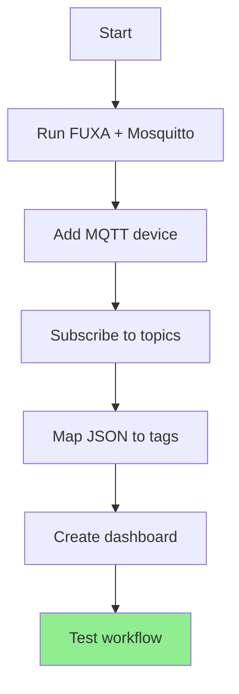
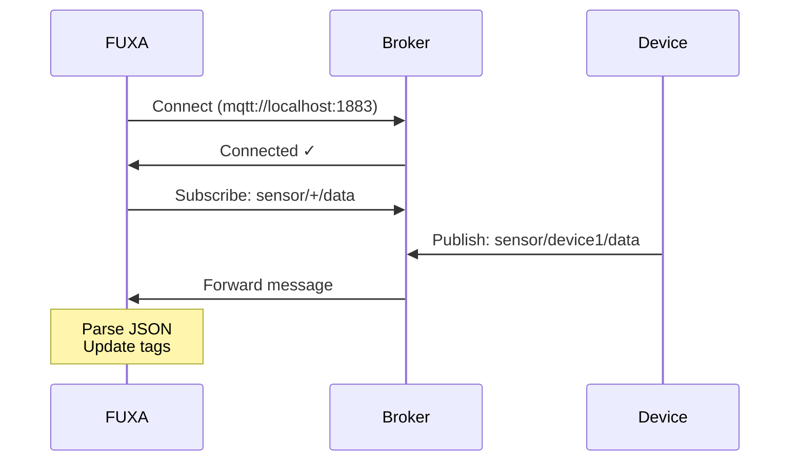
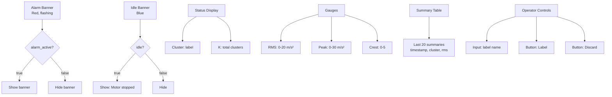
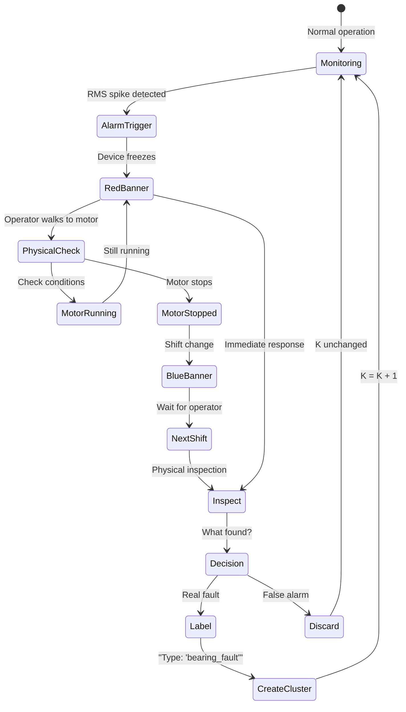
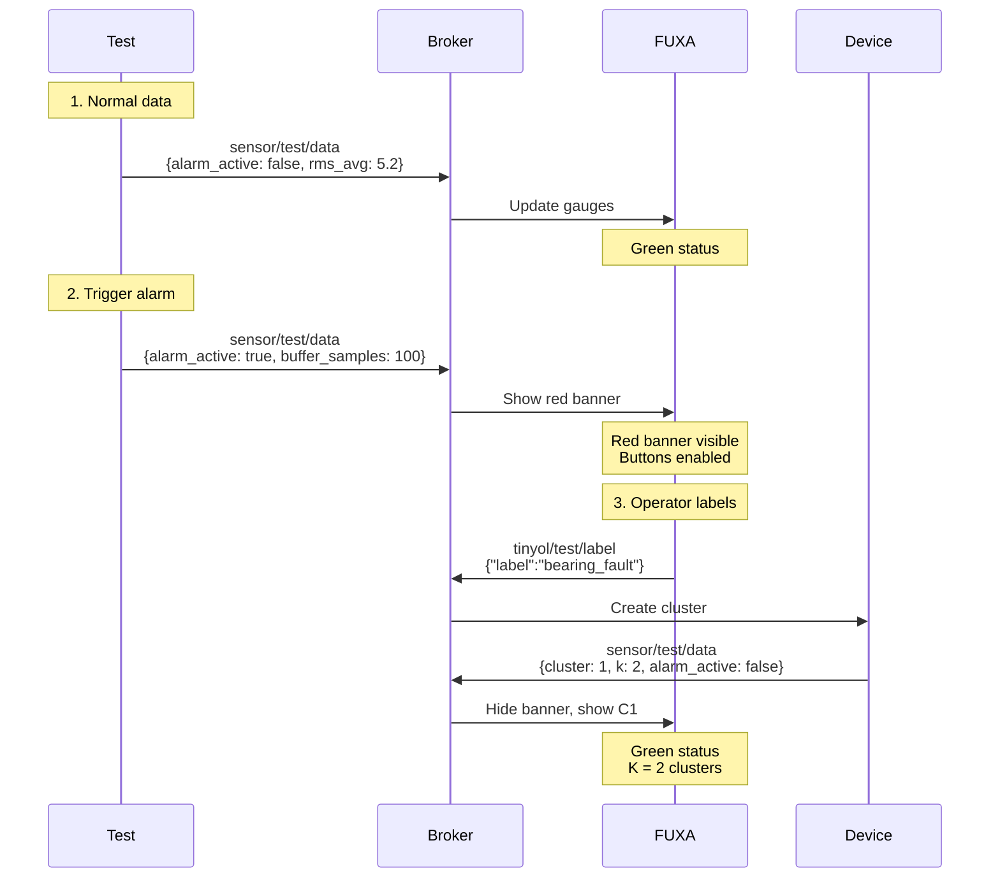
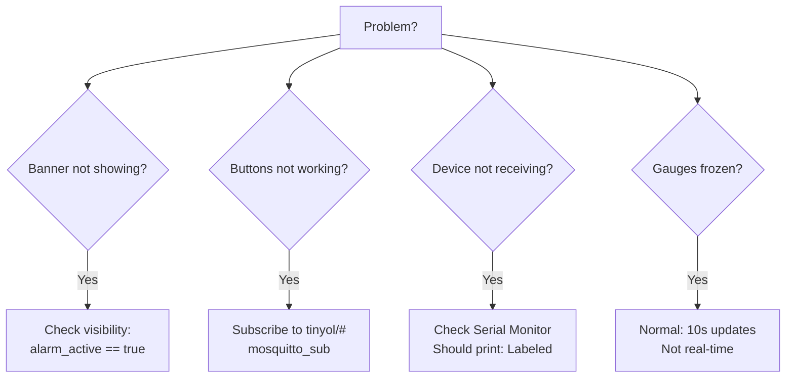
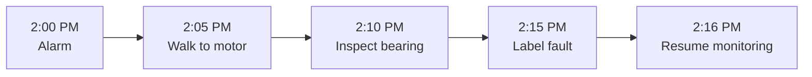
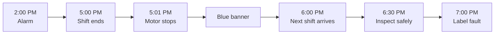
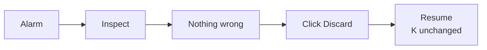

# FUXA SCADA Integration

Open-source web SCADA. Freeze-on-alarm workflow. Label outliers via dashboard.

## Setup Flow



## Quick Start

```bash
# FUXA SCADA
docker run -d -p 1881:1881 \
  -v fuxa_appdata:/usr/src/app/FUXA/server/_appdata \
  frangoteam/fuxa:latest

# Mosquitto MQTT
docker run -d -p 1883:1883 \
  -v $(pwd)/mosquitto/config:/mosquitto/config \
  eclipse-mosquitto:latest

# Access: http://localhost:1881
```

## MQTT Device Setup



**In FUXA:**

1. Connections → Add → MQTTclient
2. Name: `mqtt_broker`
3. Broker: `mqtt://localhost:1883`
4. QoS: 0 (fastest)

## Tag Mapping

**Subscribe:** `sensor/+/data` (all devices)

**Map flat JSON fields:**

| Tag | JSON Path | Type | Description |
|-----|-----------|------|-------------|
| alarm_active | `alarm_active` | bool | Red banner visible |
| frozen | `frozen` | bool | Sampling stopped |
| idle | `idle` | bool | Motor stopped |
| cluster | `cluster` | int | Current cluster ID |
| label | `label` | string | Fault name |
| k | `k` | int | Total clusters |
| rms_avg | `rms_avg` | float | Vibration (10s avg) |
| rms_max | `rms_max` | float | Vibration (10s max) |
| peak_avg | `peak_avg` | float | Peak (10s avg) |
| crest_avg | `crest_avg` | float | Crest (10s avg) |
| buffer_samples | `buffer_samples` | int | Frozen buffer size |

## Dashboard Layout



## Operator Workflow



## Widget Configuration

**1. Alarm Banner**

```yaml
Type: Rectangle
Visibility: alarm_active == true
Background: #FF0000 (red)
Text: "⚠️ ANOMALY DETECTED - INSPECT MOTOR"
Font: Bold, 24px
Position: Top, full width
Animation: Flashing (optional)
```

**2. Idle Banner**

```yaml
Type: Rectangle
Visibility: idle == true
Background: #2196F3 (blue)
Text: "⏸️ MOTOR IDLE - Alarm Held"
Font: Normal, 18px
Position: Below alarm banner
Height: 50px
```

**3. Gauges**

```yaml
RMS Gauge:
  Min: 0
  Max: 20
  Bind: rms_avg
  Yellow: >10
  Red: >15

Peak Gauge:
  Min: 0
  Max: 30
  Bind: peak_avg
  Yellow: >15
  Red: >20

Crest Gauge:
  Min: 0
  Max: 5
  Bind: crest_avg
  Yellow: >2
  Red: >3
```

**4. Label Button**

```yaml
Type: Button
Text: "Label"
Enabled: alarm_active == true
Action: MQTT Publish
  Topic: tinyol/{device_id}/label
  Payload: {"label":"${label_input}"}
```

**5. Discard Button**

```yaml
Type: Button
Text: "Discard"
Enabled: alarm_active == true
Action: MQTT Publish
  Topic: tinyol/{device_id}/discard
  Payload: {"discard":true}
```

## Test Workflow



## Troubleshooting



## Manual Testing

**1. Publish normal data:**

```bash
mosquitto_pub -h localhost -t "sensor/test/data" \
  -m '{
    "alarm_active":false,
    "frozen":false,
    "idle":false,
    "cluster":0,
    "label":"normal",
    "rms_avg":5.2,
    "peak_avg":9.1,
    "crest_avg":1.75
  }'
```

**2. Trigger alarm:**

```bash
mosquitto_pub -h localhost -t "sensor/test/data" \
  -m '{
    "alarm_active":true,
    "frozen":true,
    "cluster":-1,
    "buffer_samples":100,
    "rms_avg":12.3
  }'
```

**3. Test idle:**

```bash
mosquitto_pub -h localhost -t "sensor/test/data" \
  -m '{
    "alarm_active":true,
    "frozen":true,
    "idle":true,
    "rms_avg":0.3
  }'
```

**4. Send label:**

```bash
mosquitto_pub -h localhost \
  -t "tinyol/test_device/label" \
  -m '{"label":"bearing_fault"}'
```

## Real Scenarios

### Scenario A: Immediate Response



### Scenario B: Shift Change



### Scenario C: False Alarm



## Production Config

**Security (optional):**

```bash
# Mosquitto with auth
listener 8883
cafile /mosquitto/config/ca.crt
certfile /mosquitto/config/server.crt
keyfile /mosquitto/config/server.key
allow_anonymous false
password_file /mosquitto/config/passwords

# Add user
mosquitto_passwd -c passwords device1
```

**Backup:**

```bash
# Export FUXA config
# Settings → Export → Download JSON

# Backup Mosquitto
docker cp mosquitto:/mosquitto/config backup/
```

## Next Steps

1. ✓ Run Docker containers
2. ✓ Add MQTT device
3. ✓ Map tags
4. Create dashboard widgets
5. Test with real device
6. Monitor production

**Total time:** ~30 minutes

## References

- FUXA docs: https://frangoteam.github.io/
- Mosquitto: https://mosquitto.org/
- MQTT schema: [mqtt_schema.md](../docs/mqtt_schema.md)