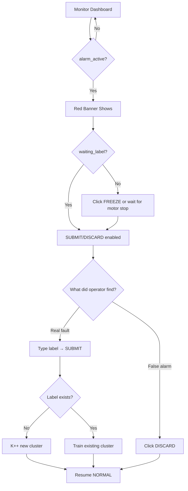

# FUXA Dashboard Design for TinyOL-HITL

## Layout (Simplified)

```
┌─────────────────────────────────────────────────────────────────┐
│  ⚠️ ANOMALY DETECTED - INSPECT MOTOR                    [ALARM] │  ← Red (alarm_active=true)
├─────────────────────────────────────────────────────────────────┤
│  ⏸️ READY FOR LABEL                                    [FROZEN] │  ← Blue (waiting_label=true)
├─────────────────────────────────────────────────────────────────┤
│                                                                 │
│  ┌──────────────┐  ┌──────────────┐  ┌──────────────┐          │
│  │   STATE      │  │   CLUSTERS   │  │    MOTOR     │          │
│  │   NORMAL     │  │    K = 2     │  │   RUNNING    │          │
│  └──────────────┘  └──────────────┘  └──────────────┘          │
│                                                                 │
│  ┌─────────────────────────────────────────────────────────┐   │
│  │  VIBRATION RMS    ████████████░░░░░░░░░░  5.2 m/s²     │   │
│  └─────────────────────────────────────────────────────────┘   │
│                                                                 │
├─────────────────────────────────────────────────────────────────┤
│  OPERATOR CONTROLS                                              │
│                                                                 │
│  Label: [_______________]  [FREEZE]     [DISCARD]    [RESET]   │
│                                                                 │
│  Hint: Type existing label to train, new label to create K++   │
└─────────────────────────────────────────────────────────────────┘
```

---

## Step-by-Step FUXA Setup

### 1. Start Services

```bash
# Terminal 1: MQTT Broker
docker run -d -p 1883:1883 --name mosquitto eclipse-mosquitto:latest

# Terminal 2: FUXA SCADA
docker run -d -p 1881:1881 --name fuxa frangoteam/fuxa:latest

# Open browser: http://localhost:1881
```

### 2. Add MQTT Connection

1. Click **Connections** (left sidebar)
2. Click **+ Add** → Select **MQTTclient**
3. Configure:
   - Name: `mqtt_broker`
   - Broker URL: `mqtt://YOUR_PC_IP:1883`
   - Client ID: `fuxa_scada`
   - QoS: 0
4. Click **Save**
5. Status should show **Connected** (green)

### 3. Create Tags (Data Bindings)

Go to **Devices** → Click your MQTT device → **Tags**

| Tag Name | Subscribe Topic | JSON Path | Type |
|----------|-----------------|-----------|------|
| `state` | `sensor/tinyol_motor01/data` | `state` | String |
| `alarm_active` | `sensor/tinyol_motor01/data` | `alarm_active` | Boolean |
| `waiting_label` | `sensor/tinyol_motor01/data` | `waiting_label` | Boolean |
| `motor_running` | `sensor/tinyol_motor01/data` | `motor_running` | Boolean |
| `k` | `sensor/tinyol_motor01/data` | `k` | Integer |
| `cluster` | `sensor/tinyol_motor01/data` | `cluster` | Integer |
| `vib_rms_avg` | `sensor/tinyol_motor01/data` | `vib_rms_avg` | Float |
| `vib_peak_max` | `sensor/tinyol_motor01/data` | `vib_peak_max` | Float |
| `buffer_samples` | `sensor/tinyol_motor01/data` | `buffer_samples` | Integer |

### 4. Create Dashboard Widgets

#### A. Alarm Banner (Red)
- **Type:** Rectangle
- **Position:** Top, full width, height 50px
- **Background:** `#FF0000` (red)
- **Text:** `⚠️ ANOMALY DETECTED - INSPECT MOTOR`
- **Font:** Bold, 18px, white
- **Visibility:** Bind to `alarm_active` → Show when `true`

#### B. Frozen Banner (Blue)
- **Type:** Rectangle
- **Position:** Below alarm banner, full width, height 40px
- **Background:** `#2196F3` (blue)
- **Text:** `⏸️ READY FOR LABEL`
- **Visibility:** Bind to `waiting_label` → Show when `true`

#### C. State Display
- **Type:** Text
- **Bind:** `state`
- **Colors:**
  - NORMAL = green
  - ALARM = red
  - WAITING_LABEL = blue

#### D. Cluster Count
- **Type:** Text
- **Format:** `K = {k}`
- **Bind:** `k`

#### E. Motor Status
- **Type:** LED indicator
- **Bind:** `motor_running`
- **On color:** Green
- **Off color:** Gray

#### F. RMS Gauge
- **Type:** Horizontal bar / Gauge
- **Bind:** `vib_rms_avg`
- **Min:** 0, **Max:** 20
- **Yellow zone:** > 10
- **Red zone:** > 15

#### G. Peak Gauge
- **Type:** Horizontal bar / Gauge
- **Bind:** `vib_peak_max`
- **Min:** 0, **Max:** 30

### 5. Create Buttons (Only 4)

#### SUBMIT Button (Label or Assign - auto-detected)
- **Type:** Button
- **Text:** "SUBMIT"
- **Enabled when:** `waiting_label == true`
- **Action:** MQTT Publish
  - Topic: `tinyol/tinyol_motor01/label`
  - Payload: `{"label":"${label_input}"}`
- **Note:** Add text input `label_input` next to it. Device auto-detects if label exists.

#### FREEZE Button
- **Type:** Button
- **Text:** "FREEZE"
- **Enabled when:** `alarm_active == true AND waiting_label == false`
- **Action:** MQTT Publish
  - Topic: `tinyol/tinyol_motor01/freeze`
  - Payload: `{"freeze":true}`

#### DISCARD Button
- **Type:** Button
- **Text:** "DISCARD"
- **Enabled when:** `waiting_label == true`
- **Action:** MQTT Publish
  - Topic: `tinyol/tinyol_motor01/discard`
  - Payload: `{"discard":true}`

#### RESET Button
- **Type:** Button
- **Text:** "RESET"
- **Background:** Red
- **Always enabled**
- **Action:** MQTT Publish
  - Topic: `tinyol/tinyol_motor01/reset`
  - Payload: `{"reset":true}`

---

## Button Enable/Disable Logic

| Button | Enabled When | Action |
|--------|--------------|--------|
| SUBMIT | `waiting_label == true` | Label (auto: new K++ or train existing) |
| FREEZE | `alarm_active == true` AND `waiting_label == false` | Manual freeze |
| DISCARD | `waiting_label == true` | Clear buffer |
| RESET | Always | Reset to K=1 |

---

## MQTT Topics (5 Total)

| Topic | Payload | Result |
|-------|---------|--------|
| `sensor/{id}/data` | Auto | Device → SCADA status |
| `tinyol/{id}/label` | `{"label":"name"}` | Auto: new cluster OR train existing |
| `tinyol/{id}/freeze` | `{"freeze":true}` | Manual freeze |
| `tinyol/{id}/discard` | `{"discard":true}` | Clear buffer |
| `tinyol/{id}/reset` | `{"reset":true}` | Reset to K=1 |

---

## Test Commands (Terminal)

```bash
# Subscribe to see device data
mosquitto_sub -h localhost -t "sensor/#" -v

# Simulate alarm (for testing FUXA without device)
mosquitto_pub -h localhost -t "sensor/tinyol_motor01/data" \
  -m '{"state":"ALARM","alarm_active":true,"waiting_label":false,"k":1,"vib_rms_avg":12.5}'

# Simulate waiting for label
mosquitto_pub -h localhost -t "sensor/tinyol_motor01/data" \
  -m '{"state":"WAITING_LABEL","alarm_active":true,"waiting_label":true,"k":1,"buffer_samples":50}'

# Send label (NEW cluster if label doesn't exist, TRAIN existing if it does)
mosquitto_pub -h localhost -t "tinyol/tinyol_motor01/label" -m '{"label":"unbalance"}'

# Send freeze command
mosquitto_pub -h localhost -t "tinyol/tinyol_motor01/freeze" -m '{"freeze":true}'

# Send discard command
mosquitto_pub -h localhost -t "tinyol/tinyol_motor01/discard" -m '{"discard":true}'

# Send reset command
mosquitto_pub -h localhost -t "tinyol/tinyol_motor01/reset" -m '{"reset":true}'
```

---

## Workflow Diagram



**Key insight:** One input handles both cases. Device auto-detects.