```mermaid
%%{init: {'themeVariables': { 'fontSize': '20px'}, 'sequence': { 'mirrorActors': false, 'messageMargin': 5 } }}%%
sequenceDiagram
    participant D as Device
    participant S as SCADA
    participant O as Operator

    alt Auto or Manual
        D->>S: state: WAITING<br/>LABEL
        Note right of O: Inspects<br/>Machine
    end

    O->>S: Label: "Unbalance"
    S->>D: update model
    D->>D: K++ (New Cluster)
    D->>S: state: NORMAL<br/>(k: 2) ✅
```

# TinyOL-HITL

**Tiny** Online Learning with **Human-in-the-Loop**

<div class="text-xl mt-4">
  <span class="px-2 py-1 rounded bg-black text-white">
    Unsupervised Fault Discovery for Industrial Condition Monitoring
  </span>
</div>

<div class="pt-4">
    <div class="pt-4 text-l opacity-75">
    Lee Kai Ze (101222041)
    </div>
    <div class="pt-4 text-l opacity-75">
    Supervisor: Ir Dr Hudyjaya Siswoyo Jo
    </div>
</div>

<div class="pt-4">
    <div class="pt-4 text-sm opacity-75">
    Robotics & Mechatronics Engineering
    </div>
    <div class="pt-4 text-sm opacity-75">
    Swinburne University of Technology Sarawak Campus
    </div>
</div>

<!--
The title might seems quite intimidating, but don’t worry we’ll go through it step by step so that we’re on the same page. Now, we can imagine what is the final product we’re envisioning first. Imagine, a small device with sensor, that you can put onto any machine, and it will learn the vibration/current/temperature/etc. pattern of the machine, and tell you if something feels off.
-->

---

# The Industrial Reality

<div class="grid grid-cols-2 gap-8">
<div>

### PdM Adoption Barriers

- **27%** actual PdM adoption rate
- **74%** Industry 4.0 pilot projects never scale
- **24%** cite expertise shortage as primary barrier
- **80%** want open standards, avoid pricey lock-in
- **70-90%** of project time is sunk into data cleaning & preparation

</div>
<div class="flex flex-col justify-center">

<figure class="flex flex-col items-center">
  
  <figcaption class="mt-3 text-xs text-center text-gray-500">
    <strong>Figure 1:</strong> Overview of PdM.<br/>
    <span class="italic opacity-75">Source: Achouch et al., Appl. Sci. 2022, 12, 8081.</span>
  </figcaption>
</figure>

</div>
</div>

<div class="text-sm mt-4 opacity-75">
Sources: McKinsey 2021, MaintainX 2025, PwC 2018, Achouch et al., 2022
</div>

<!--
The purpose of such a condition monitoring is to achieve predictive maintenance as shown in the figure here. To prevent unplanned downtime when machine totally break down, we can smoothly plan for inspection and repair when the machine starts giving signal to the sensor that something is wrong.

Although knowing the benefits, the adoption still only at 27%, where traditionally they need ML engineer to connect all the sensors, to collect data and train models, where majority of the time is wasted on preparing the data, and 74% of pdm stuck at pilot projects. 24% of company cite that they cannot hire suitable experts to do such job where 80% of the companies is looking for cheaper open standard, easy to implement solutions.

To tackle these, moving towards Tiny Machine Learning make sense, as it get rids of the complex infrastructure, and make those small devices dedicated to achieve exactly the intended function.
-->

---

# State of the Art: TinyML for PdM

<div class="text-sm">

| Approach | Method | Unsupervised | Online | Memory |
|----------|--------|--------------|--------|--------|
| Amruthnath 2018 | K-Means + PCA | ✓ | ✗ Batch | Cloud |
| Isolation Forest | Tree-based | ✓ | ✗ Batch | ~50KB |
| TinyOL (Ren 2021) | Autoencoder | ✗ Pre-train | ✓ | ~100KB |
| MCUNetV3 (Lin 2022) | CNN | ✗ Pre-train | ✓ | 256KB |
| **TinyOL-HITL** | **Streaming K-Means** | **✓** | **✓** | **<5KB** |

</div>

<span></span>

### The Gap
- Amruthnath showed K-means detects faults **without labels** (~80% on CWRU)
- But **batch-only**: needs full dataset upfront, incompatible with edge
- TinyOL/MCUNetV3: online learning, but **need pre-trained models**
- **No system combines: unsupervised + online + HITL + tiny**

<!--
If you still haven’t grasp what is TinyML, actually we all have all use it before, the “Ok, Google” or “Hey, Siri” is the earliest form of TinyML, it uses a dedicated chip on your phone, to learn your voice, and next time it can detect your calling it.

Similarly, we can create device that can learn by sensing a machine, to detect different conditions of a machine.

There has been a wide range of researches in this area, trying to run more and more complex neural networks or algorithms on smaller and smaller devices. But we’ll focus on two aspects today, the unsupervised and online learning of it, for some reasons we’ll talk about.

What is unsupervised learning, it means the device figure out different machine conditions by itself, without you teaching it. And online learning is when the device adapts to new conditions over time.

There had been some researches on those within the area, but frankly, no one combine those two into a pragmatic solution.
-->

---

# Why Unsupervised and Online Learning Matters

```mermaid
%%{init: {'themeVariables': { 'fontSize': '22px' }}}%%
flowchart LR
 subgraph Solution["TinyOL-HITL"]
    direction TB
        K["✓ Adapts"]
        J["K Grows: 1→N"]
        I["Op. Labels"]
        H["Start K=1"]
  end
    A["New Machine<br>Deployed"] --> B["**Historical<br>Fault Data?**"]
    B -- Yes --> C["Train Supervised<br>Model"]
    B -- No --> Solution
    C --> E["**All Faults<br>Known?**"]
    E -- Yes --> F["Deploy Static<br>Model"]
    E -- No --> Solution
    H --> I
    I --> J
    J --> K

    K:::success
    J:::success
    I:::success
    H:::success
    classDef fail fill:#f9f,stroke:#333,stroke-width:2px
    classDef success fill:#9f9,stroke:#333,stroke-width:2px
```

<div class="flex justify-center">
<div class="w-200">



</div>
</div>

<!--
So why do those abilities important, let’s imagine, when we buy a new machine, there is no way to generate fault data of it. And even when we have train a model, we might run the machine in different conditions or the readings will naturally drift even though the machine is running fine, so we need a model that is capable of adapting over time.

So we come up with Tiny Online Learning with Human in the Loop to adapt over time reliably.
-->

---

# Research Questions

<div class="grid grid-cols-2 gap-6 mt-4">

<div class="p-4 border rounded">

### RQ1: Automatic Detection
Can the framework detect different industrial conditions automatically without pre-labeled training data?

</div>

<div class="p-4 border rounded">

### RQ2: HITL Feedback
Does the human-in-the-loop mechanism allow proper feedback to refine the model over time?

</div>

<div class="p-4 border rounded">

### RQ3: Accuracy
Does classification accuracy remain stable across varying operating conditions and time?

</div>

<div class="p-4 border rounded">

### RQ4: Accessibility
Can low-technical personnel train and operate the system in a natural, intuitive way?

</div>

</div>

<!--
Let’s summarize into 4 questions we’re trying to answer, is such a model capable of: Automatic detect machine abnomalies, learn the condition through human in the loop, stay accurate throughout and intuitive to be used by a non-technical personnel.
-->

---

# Research Design

<div class="flex justify-center">
<div class="w-200">


</div>
</div>

<!--
So we split the research into 3 phases. First, we develop the model and make sure it achieve a good baseline accuracy in comparison with studies done on a industry-standard public dataset. Then we can implement the model in real world to test it’s capabilities in different conditions. And lastly we make sure the whole user experience is straightforward, accessible and explainable to non-technical person.
-->

---

# Streaming K-Means: The Algorithm

<div class="grid grid-cols-2 gap-8 items-center mt-4">
<div>

### EMA Update Rule

$$c_{new} = c_{old} + \alpha (x - c_{old})$$

$$\alpha = \frac{\alpha_{base}}{1 + 0.01 \times count}$$

### Why Streaming Works
- **Small drift:** Centroid follows gradually
- **Stable over time:** α decays with count
- **O(1) memory:** No history stored

```mermaid
graph TD
    A([New Sample x]) --> B[Find nearest cluster k*]
    B --> C{distance < τ ?}
    C -- Yes --> D[Update centroid via EMA]
    C -- No --> E[ANOMALY: Buffer sample]
    D --> F([Next sample])
    E --> G[Continue buffering until freeze]
```

</div>
<div class="flex justify-center">



</div>
</div>

<div class="mt-4 p-3 bg-yellow-50 rounded text-sm">
<strong>Key difference from batch k-means:</strong> Process one sample at a time. Never store full dataset. K can grow.
</div>

<!--
PRESENTER NOTES:

The EMA (Exponential Moving Average) makes this "streaming" - no historical storage needed.

Walk through the equation:
- α_base typically 0.2 (20% weight to new sample)
- As count grows, α shrinks - early samples matter more
- After 100 samples: α ≈ 0.1. After 1000: α ≈ 0.02

Threshold τ is based on cluster "radius" (inertia). Sample at 2× typical distance = anomaly.

IMPORTANT: Anomaly samples get BUFFERED (up to 100) while waiting for operator. We don't just keep 1 sample - we capture the whole anomaly event for proper training.
-->

---

# Human-in-the-Loop: Three Operator Actions

When anomaly detected, system buffers samples. Operator inspects machine and chooses:

<div class="grid grid-cols-3 gap-4 mt-4">

<div class="p-4 border-2 border-green-500 rounded text-sm">

### 1. New Label
**"Never seen this fault"**

- Creates cluster **K++**
- Centroid = buffer average
- Trained with N samples

```
Buffer: 87 samples
    ↓
K=3, "bearing_wear"
count = 87
```

</div>

<div class="p-4 border-2 border-blue-500 rounded text-sm">

### 2. Assign Existing
**"This is cluster X"**

- Trains cluster X with buffer
- **K stays same**
- Refines existing cluster

```
Buffer: 87 samples
    ↓
Cluster "unbalance"
count += 87
```

</div>

<div class="p-4 border-2 border-gray-500 rounded text-sm">

### 3. Discard
**"False alarm / noise"**

- Clears buffer
- **K unchanged**
- No learning

```
Buffer: 87 samples
    ↓
Deleted
```

</div>

</div>

<div class="flex justify-center mt-4">


</div>

<!--
PRESENTER NOTES:

This is crucial for CWRU testing. We have 4 classes: normal, ball, inner, outer.

Without "Assign Existing":
- First ball fault → K=2 "ball"
- Second ball fault → K=3 "ball2" (wrong! should be same cluster)

With "Assign Existing":
- First ball fault → K=2 "ball" (new label)
- Second ball fault → assign to cluster 1 → K stays 2, cluster refined

The buffer is key. When motor stops, we might have 87 anomaly samples captured. All 87 train the cluster - not just 1 sample. This makes clusters robust.

CWRU workflow:
1. Stream normal → K=1
2. First ball anomaly → new label "ball" → K=2
3. More ball anomalies → assign existing cluster 1
4. First inner race anomaly → new label "inner" → K=3
5. More inner → assign existing cluster 2
6. First outer → K=4
7. Final: K=4 matching the 4 CWRU classes
-->

---

# TinyML Optimizations

<div class="grid grid-cols-2 gap-8">
<div>

### Memory Layout

```c
// Total: ~2.5 - 5 KB
typedef struct {
  cluster_t clusters[16];  // 1.0 KB
  ring_buffer_t buffer;    // 1.2 KB
  uint8_t k, feature_dim;  // 0.3 KB
} kmeans_model_t;
```

### Fixed-Point Math (Q16.16)

```c
#define FLOAT_TO_FIXED(x) \
  ((int32_t)((x) * 65536))
#define FIXED_MUL(a, b) \
  (((int64_t)(a) * (b)) >> 16)
```

</div>
<div>

### Optimization Techniques

| Technique | Benefit |
|-----------|---------|
| Q16.16 fixed-point | No FPU required |
| Squared distance | Avoids sqrt (~30% faster) |
| EMA updates | O(1) memory per sample |
| Static allocation | No malloc/fragmentation |
| Ring buffer | Bounded 100 samples |

</div>
</div>

<!--
Then we’ll optimise the algorithm for least memory consumption with standard ways, getting rid of floating point, avoid square root, EMA updates, static memory allocation, ring buffer. (More details explanations to be updated)
-->

---

# HITL: The State Machine

Alarm ≠ Freeze. The system distinguishes between transient alarms and label-ready states.

<div class="flex justify-center">
<div class="w-140">


</div>
</div>

<!--
And for the human in the loop part, the model initialised with one cluster, upon unsupervised abnormally detected, when the motor stopped, or when operator manually freeze the input, labelling can be done, where the model will learn if this cluster should be discarded, or learn as new cluster, or included into previous cluster.
-->

---

# CWRU Benchmark

<div class="grid grid-cols-2 gap-6">
<div>

### Test Configuration

- **Split:** 70% train / 30% test
- **Buffer:** 20 samples per label event
- **Threshold:** 5.0× cluster radius
- **Runs:** 10 (different seeds)

### Results

| Method | Accuracy | Classes | Memory |
|--------|----------|---------|--------|
| Naive Bayes* | 69.5% | 4-class | Batch |
| **TinyOL-HITL** | **75.8%** | 4-class | O(1) |

<div class="text-xs mt-2 opacity-75">
*Rosa et al. (2024) - proper bearing split, no data leakage
</div>

<div class="text-sm mt-2 p-2 bg-green-50 rounded">
✓ Outperforms non-NN baseline by 6.3% while streaming
</div>

</div>
<div>

### Confusion Matrix (K=4)

Sample Run:

```
              Predicted
           Norm  Ball  Innr  Outr
Actual
Normal     125    1     0     0
Ball        68    9     0     0
Inner        0   11    73     0
Outer        0    0     0    70
```

<div class="text-xs mt-2 opacity-75">
Test set: 0.007" fault diameter, 12kHz sampling
</div>

<div class="mt-4 text-sm p-3 bg-yellow-50 rounded">
<strong>Ball-Normal overlap:</strong> Smith & Randall (2015) note ball faults produce subtle signatures
that require frequency-domain analysis for reliable separation—a known CWRU benchmark limitation.
</div>

</div>
</div>

<!--
Key message: We beat Rosa et al. (2024) Naive Bayes baseline by 6.3 percentage points.

Why this comparison matters:
- Rosa et al. is the most recent CWRU benchmark paper (July 2024)
- They fixed the data leakage problem that inflated older results (95-99%)
- Their proper bearing split gives realistic accuracy: Naive Bayes dropped from 85.8% to 69.5%
- We achieve 75.8% with STREAMING (O(1) memory) vs their BATCH approach

Ball fault confusion is documented in Smith & Randall (2015) - ball defects produce subtle time-domain signatures that overlap with normal operation.

Bottom line: First streaming k-means to outperform proper-split baselines on CWRU.
-->

---

# Test Rig Configuration

<div class="grid grid-cols-2 gap-8">
<div>

### Hardware Platform

| Component | Specification |
|-----------|---------------|
| MCU 1 | ESP32 DEVKIT V1 (Xtensa) |
| MCU 2 | RP2350 Pico 2W (ARM) |
| Vibration | MPU6050 / ADXL345 |
| Current | ZMCT103C × 3 phases |
| Motor | 2 HP, 3 phases asynchronous |
| Control | VFD (0-60 Hz) |

</div>
<div>

### Test Conditions

| Type | Conditions |
|------|------------|
| **Normal** | Stopped |
| | 15 Hz running |
| | 20 Hz running |
| **Faults** | Eccentric weight (light) |
| | Eccentric weight (heavy) |
| | Phase loss |

</div>
</div>

<!--
Then we can implement it on a real-world system, we test run on multiple type of microcontrollers and sensors, showing it is hardware-agnostic, where the framework can be applied to every kind of sensor device setup, and make sure the test is not biased.

We measure the vibration and current of a 3 phase asynchronous motor with variable speed. Where we inject different conditions or faults to be detected, included motor running on different speeds, having different severity of rotor imbalance, and lost of single phase.
-->

---

# Feature Schemas

Three feature sets to balance accuracy vs. complexity.

<div class="text-sm">

| Schema | Features | Dim | Memory | Use Case |
|--------|----------|-----|--------|----------|
| **TIME_ONLY** | RMS, Peak, Crest | 3D | 1.6 KB | Minimal setup |
| **FFT_TIME** | Time + HR₁, HR₂, HER, SF, SK, ΔC | 9D | 4.5 KB | Better accuracy |
| **FFT_CURRENT** | FFT_TIME + i₁, i₂, i₃ | 12D | 5.0 KB | Full diagnosis |

</div>

<div class="grid grid-cols-2 gap-4 mt-4 text-sm">
<div>

### Time-Domain Features
```c
rms   = sqrt(mean(ac²))  // Energy
peak  = max(|ac|)        // Amplitude
crest = peak / rms       // Impulsiveness
```

</div>
<div>

### FFT Features (Kumar 2024, Teixeira 2024)
- **HR₁/HR₂**: Harmonic ratios → imbalance, phase loss
- **HER**: High-freq energy → bearing faults
- **SF/SK**: Spectral shape → fault type
- **ΔC**: Centroid drift → speed variation

</div>
</div>

<!--
Then we take different set of features we can feed into the model to test out the performance. Where the industry-standard is using FFT to get more useful frequency-domain signatures. So the full diagnosis will be based on 12 dimensions of data on different vibration frequency signatures and electrical current data.
-->

---

# Demo: HITL Workflow

```mermaid
%%{init: {'themeVariables': { 'fontSize': '20px'}, 'sequence': { 'mirrorActors': false, 'messageMargin': 10 } }}%%
sequenceDiagram
    participant M as Motor
    participant D as Device
    participant S as SCADA

    M->>D: Normal vib.
    D->>S: state: NORMAL ✅

    Note over M: Fault<br/>Develops
    M->>D: High vib.
    D->>S: state: ALARM 🔴

    Note right of S: Operator sees<br/>Red Banner
```

<div class="grid grid-cols-2 gap-2">

<!-- LEFT COLUMN: DETECTION -->
<div>
<h3 class="text-center opacity-80 mb-2">1. Fault Detection</h3>


</div>

<!-- RIGHT COLUMN: RESOLUTION -->
<div>
<h3 class="text-center opacity-80 mb-2">2. HITL Resolution</h3>


</div>

</div>

<div class="text-center mt-6 text-sm opacity-75">
The system transitions from <strong>Alarm</strong> to <strong>Learning</strong> seamlessly via the freeze mechanism.
</div>

<!--
So here’s how our test is carried out, we have the motor run with normal condition which the status is shown on a SCADA interface. Then upon injecting a different running condition or fault, it will detect the abnormally and show on SCADA.

The system will switch from alarm to learning mode upon motor stopped, or operator manually freeze through SCADA.

Then the operator can inspect the machine, and label or discard the alarm. The device learn the pattern, so next time it’ll give correct prediction.

Script: [Show the APIs and steps to connect to SCADA and overall workflow for operator]
-->

---

# MQTT Integration

<div class="grid grid-cols-2 gap-6">
<div>

| Topic | SCADA (In/Out) | Action |
|-------|-----|--------|
| `sensor/{id}/data` | In | Status |
| `tinyol/{id}/label` | Out | Assign: New/existing cluster |
| `tinyol/{id}/discard` | Out | False alarm |
| `tinyol/{id}/freeze` | Out | Switch to labelling |
| `tinyol/{id}/reset` | Out | Reset K=1 |

</div>
<div>

### Example Payloads

**Device publishes:**
```json
{"state":"ALARM", "k":2, "rms_avg":12.3}
```

**Operator sends:**
```json
{"label": "unbalance"}
```
```json
{"cluster_id": 1}
```
```json
{"discard": true}
```

</div>
</div>

<div class="mt-4 text-sm opacity-75">
Works with: FUXA, Node-RED, RapidSCADA, any MQTT broker
</div>

<!--
To allow the operator interaction, a standard set of MQTT API is given and set in SCADA, the operator can get the system status, freeze the system, label or discard the state.

(Then show video or pictures of real-world test)
-->

---

# Model Performance

<div class="grid grid-cols-2 gap-4">

<div>
(TODO) Showing Passed All Tests
</div>

<div>

### Memory Comparison


**TinyOL-HITL: ~5 KB** — Runs on virtually any MCU (20× smaller than TinyOL)

</div>
</div>

<!--
(Showing the accuracy of each condition, and maybe through majority voting, it achieve perfect accuracy)

And with all these features, it run at X kb memory, able to be deployed on most microcontrollers.
-->

---

# Key Contributions

<div class="flex justify-center">

| Aspect | TinyOL (Ren 2021) | TinyOL-HITL (Ours) |
|--------|-------------------|---------------------|
| Pre-training | ✓ Required | ✗ None |
| Initial classes | Fixed | K=1, grows dynamically |
| Memory | ~100KB SRAM | < 5 KB total |
| Alarm Logic | N/A | State Machine (Alarm ≠ Freeze) |
| HITL | None | Core feature |
| Protocol | Proprietary | Standard MQTT |

</div>

<v-click>

### Development Roadmap

- **Custom Hardware:** Build custom PCB into a minimal form factor.
- **Multi-Modal:** Test with temperature, humidity, and sound sensors.
- **Transfer Learning:** Vendor pre-trained base models with client-side incremental learning.
- **Self-Sustained:** Energy harvesting integration for true plug-and-play.

</v-click>

<!--
In comparison with the TinyOL model proposed by Siemens research team, our framework gives a more intuitive implementation flow for less technical personnel.

Future enhancements:
1. Company can build custom PCB into a minimal form to attach onto any machines.
2. Can test the performance with different sensors/combinations, including also temperature/humidity/sound etc.
3. Vendor can train base model for specific machine with known conditions, using Transfer Learning idea to build a purpose-built device, yet it will incremental learn special use-cases of client.
4. Make it self-sustained, with energy harvesting through vibration/temperature, so that it can truly be a modular plug-and-play device that you put on any machinery.
-->

---
layout: center
---

# Conclusion

<v-clicks>

### Sometimes the most accessible solution wins.

- No cloud. No pre-training. No vendor lock-in.
- **Plug-and-play. Learn as you go.**
- **Core Innovation:** A label-driven clustering engine with a robust state machine that puts the operator in control.
- TinyOL-HITL proves: Unsupervised + Human-in-the-Loop can be Industrial-Ready PdM

</v-clicks>

<!--
Sometimes it is better to take a step back and see what is the simplest way to solve the most pressing problem. Instead of making the solution more complex, sometimes we just need to make it more accessible. For the research conclusion, Tiny Online-Learning with Human-in-the-loop is plausible for Industrial Condition Monitoring, even for less technical personnel.
-->

---
layout: end
---

# Questions?

<div class="grid grid-cols-1 gap-8 mt-8">
<div>

### Resources
Code: [github.com/leekaize/tinyol-hitl](https://github.com/leekaize/tinyol-hitl)

Slides: [leekaize.github.io/tinyol-hitl](https://leekaize.github.io/tinyol-hitl)

Paper: [paper.pdf](https://raw.githubusercontent.com/leekaize/tinyol-hitl/main/paper.pdf)

</div>
<div>

### Contact

Email: mail@leekaize.com

</div>
</div>