# TinyOL-HITL

**Tiny** Online Learning with **Human-in-the-Loop**

<div class="text-xl mt-4">
Unsupervised Fault Discovery for Industrial Condition Monitoring
</div>

<div class="pt-8">
  <span class="px-2 py-1 rounded bg-blue-500 text-white">
    Lee Kai Ze • Swinburne University of Technology
  </span>
</div>

<div class="pt-4 text-sm opacity-75">
Supervised by Dr Hudyjaya Siswoyo Jo
</div>

<!--
Breaking down the title:
- **Tiny** = Runs on microcontrollers (<3KB RAM)
- **Online Learning** = Learns continuously from streaming data
- **Human-in-the-Loop** = Operators label faults as discovered

The result: Deploy immediately. No pre-training. System learns your specific machine.
-->

---

# The Industrial Reality

<div class="grid grid-cols-2 gap-8">
<div>

### PdM Adoption Barriers

<v-clicks>

- **27%** actual PdM adoption rate
- **74%** Industry 4.0 pilots never scale
- **24%** cite expertise as primary barrier
- **80%** want open standards, avoid lock-in

</v-clicks>

</div>
<div>


</div>
</div>

<div class="text-sm mt-4 opacity-75" v-click>
Sources: McKinsey 2021, MaintainX 2025, PwC 2018
</div>

---

# State of the Art: TinyML for PdM

<div class="text-sm">

| Approach | Pre-Training | Memory | HITL | Platform |
|----------|-------------|--------|------|----------|
| TinyOL (Ren 2021) | ✓ Autoencoder | ~100KB | ✗ | Cortex-M4 |
| MCUNetV3 (Lin 2022) | ✓ CNN | 256KB | ✗ | Cortex-M7 |
| TinyTL (Cai 2020) | ✓ Frozen weights | ~50KB | ✗ | Cortex-M4 |
| Cloud ML | ✓ Large datasets | N/A | ✗ | Server-side |
| **TinyOL-HITL** | **✗ None** | **2.5 - 3.0 KB** | **✓** | **Multi-arch** |

</div>

<v-click>

### The Gap
All existing TinyML solutions require **pre-trained models**.
Real industrial deployment: **fault types unknown until discovered**.

</v-click>

---

# Why Unsupervised Start Matters

<div class="flex justify-center">
<div class="w-140">


</div>
</div>

---

# Research Design & Comparison

<div class="flex justify-center">
<div class="w-160">


</div>
</div>

<div class="grid grid-cols-2 gap-4 mt-4 text-sm">
<div>

**Research Question 1:**
Does adding current sensing (multimodal) improve classification accuracy in low-memory environments?

</div>
<div>

**Research Question 2:**
Can an effective Human-in-the-Loop workflow be implemented on microcontrollers with <3KB RAM?

</div>
</div>

---

# Feature Schemas

We evaluate four feature sets to balance accuracy vs. memory.

<div class="text-xs">

| Schema | Features | Dim | Memory |
|--------|----------|-----|--------|
| **TIME_ONLY** | rms, peak, crest | 3D | 1.6 KB |
| **TIME_CURRENT** | + i₁, i₂, i₃, i_rms | 7D | 2.2 KB |
| **FFT_ONLY** | + freq, amp, centroid | 6D | 2.0 KB |
| **FFT_CURRENT** | All above | 10D | 3.0 KB |

</div>

<div class="grid grid-cols-2 gap-4 mt-4">
<div>

### Core Math (Time-Domain)
```c
// Always computed
rms   = sqrt((ax² + ay² + az²) / 3)
peak  = max(|ax|, |ay|, |az|)
crest = peak / rms  // >2.5 = impulsive
```

</div>
<div>

### Feature Extraction Flow

</div>
</div>

---

# Test Rig Configuration

<div class="grid grid-cols-2 gap-8">
<div>

### Hardware Platform

| Component | Model |
|-----------|-------|
| MCU 1 | ESP32 DEVKIT V1 (Xtensa) |
| MCU 2 | RP2350 Pico 2W (ARM) |
| Vibration | MPU6050 + ADXL345 |
| Current | ZMCT103C × 3 phases |
| Motor | 0.5 HP, 1500 RPM |
| Control | VFD (0-60 Hz) |

</div>
<div>

### Fault Simulation

| Condition | Method |
|-----------|--------|
| Baseline | Balanced rotor |
| Unbalance | 50-200 g·mm eccentric |
| Speed var | VFD: 25, 40, 50, 60 Hz |

**Why eccentric weight:**
- Non-destructive & repeatable
- Clear vibration signature
- Industry-standard test

</div>
</div>

---

# Algorithm: The State Machine

**Key Innovation:** Alarm ≠ Freeze. The system distinguishes between transient alarms and label-ready states.

```mermaid
stateDiagram-v2
    [*] --> NORMAL: Initialize K=1

    NORMAL --> ALARM: Outlier detected
    note right of ALARM: Motor running<br/>Red banner on SCADA

    ALARM --> NORMAL: 3s normal (auto-clear)

    ALARM --> WAITING_LABEL: Motor stops
    ALARM --> WAITING_LABEL: Operator hits Freeze
    note right of WAITING_LABEL: Buffer Frozen<br/>Ready for input

    WAITING_LABEL --> NORMAL: Label "Fault" → K++
    WAITING_LABEL --> NORMAL: Discard (False Alarm)
```

<div class="flex justify-center">
<div class="w-140">



</div>
</div>

---

# TinyML Optimizations

<div class="grid grid-cols-2 gap-8">
<div>

### Memory Layout

```c
// Total: ~2.5 - 3.0 KB
typedef struct {
  cluster_t clusters[16];  // 1.0 KB
  ring_buffer_t buffer;    // 1.2 KB
  uint8_t k, feature_dim;  // 0.3 KB
} kmeans_model_t;
```

### Fixed-Point Math (Q16.16)

```c
#define FLOAT_TO_FIXED(x) \
  ((int32_t)((x) * 65536))
#define FIXED_MUL(a, b) \
  (((int64_t)(a) * (b)) >> 16)
```

</div>
<div>

### Optimization Techniques

| Technique | Benefit |
|-----------|---------|
| Q16.16 fixed-point | No FPU required |
| Squared distance | Avoids sqrt (~30% faster) |
| EMA updates | O(1) memory per sample |
| Static allocation | No malloc/fragmentation |
| Ring buffer | Bounded 100 samples |

</div>
</div>

---

# Memory Comparison

<div class="flex justify-center">


</div>

<div class="text-center mt-4">

**TinyOL-HITL: ~3 KB** — Runs on virtually any MCU (33× smaller than TinyOL)

</div>

---

# Results: Accuracy & Performance

<div class="grid grid-cols-2 gap-8">
<div>

### CWRU Benchmark (Accuracy)

| Schema | Baseline | +HITL |
|--------|----------|-------|
| TIME_ONLY (3D) | [DATA]% | [DATA]% |
| TIME_CURRENT (7D) | [DATA]% | [DATA]% |
| FFT_ONLY (6D) | [DATA]% | [DATA]% |
| FFT_CURRENT (10D)| [DATA]% | [DATA]% |

**Confusion Matrix (Sample)**
```
              Predicted
           N    B    I    O
Actual N [   ][   ][   ][   ]
       B [   ][   ][   ][   ]
```

</div>
<div>

### Hardware Performance

**Detection Latency:**
- Alarm trigger: **[DATA] samples**
- Time to detection: **[DATA] seconds**

**Cross-Platform Consistency:**
- Target: Centroid delta < 0.1
- ESP32 vs RP2350: **[DATA]**

</div>
</div>

<div class="text-sm mt-4 opacity-75">
Note: We avoid common data leakage (Rosa 2024) by using proper train/test splits.
</div>

---

# Live Demo: HITL Workflow

```mermaid
sequenceDiagram
    participant M as Motor
    participant D as Device
    participant S as SCADA
    participant O as Operator

    M->>D: Normal vibration
    D->>S: state: NORMAL ✅

    Note over M: Fault develops
    M->>D: High vibration
    D->>S: state: ALARM 🔴

    alt Motor stops
        M->>D: RMS → 0
        D->>S: state: WAITING_LABEL
    else Operator clicks Freeze
        O->>S: Freeze button
        S->>D: freeze command
        D->>S: state: WAITING_LABEL
    end

    O->>S: Label: "unbalance"
    D->>D: K++ (K=2)
    D->>S: state: NORMAL, k: 2 ✅
```

<div class="flex justify-center">
<div class="w-140">



</div>
</div>

---

# Integration: API & MQTT

<div class="grid grid-cols-2 gap-4">
<div>

### Device API (8 Functions)

```c
// 1. Init K=1
kmeans_init(&model, FEATURE_DIM, 0.2f);

// 2. Stream & Update
int8_t c = kmeans_update(&model, feats);

// 3. Handle Alarm Logic
if (c == -1 && kmeans_is_waiting(&model)) {
    // Operator labeled via MQTT
    kmeans_add_cluster(&model, "fault");
}

// 4. Manual Freeze
kmeans_request_label(&model);
```

</div>
<div>

### SCADA JSON Payload

```json
{
  "device_id": "motor_01",
  "state": "ALARM",
  "cluster": -1,
  "k": 1,
  "rms_avg": 5.2,
  "peak_avg": 9.1
}
```

**Topics:** `data`, `label`, `discard`, `freeze`

</div>
</div>

---

# Key Contributions

<div class="flex justify-center">

| Aspect | TinyOL (Ren 2021) | TinyOL-HITL (Ours) |
|--------|-------------------|---------------------|
| Pre-training | ✓ Required | ✗ None |
| Initial classes | Fixed | K=1, grows dynamically |
| Memory | ~100KB SRAM | 3 KB total |
| Alarm Logic | N/A | State Machine (Alarm ≠ Freeze) |
| HITL | None | Core feature |
| Protocol | Proprietary | Standard MQTT |

</div>

<v-click>

### Development Roadmap
- **Current:** Research Prototype & Algorithm Validation
- **Future:** Cluster merging, Auto-threshold tuning, Energy harvesting support

</v-click>

---
layout: center
class: text-center
---

# Conclusion

<v-clicks>

### Sometimes the simplest solution wins.

**No cloud.** No pre-training. No vendor lock-in.

**Deploy Day 1. Learn as you go.**

**Core Innovation:** A 3KB label-driven clustering engine with a robust state machine that puts the operator in control.

TinyOL-HITL proves: Unsupervised + Human-in-the-Loop = Industrial-Ready PdM

</v-clicks>

---
layout: end
---

# Questions?

<div class="grid grid-cols-2 gap-8 mt-8">
<div>

### Resources
- Code: [github.com/leekaize/tinyol-hitl](https://github.com/leekaize/tinyol-hitl)
- Slides: [leekaize.github.io/tinyol-hitl](https://leekaize.github.io/tinyol-hitl)

</div>
<div>

### Contact
- Email: mail@leekaize.com
- Supervisor: Dr Hudyjaya Siswoyo Jo

</div>
</div>