# TinyOL-HITL

**Tiny** Online Learning with **Human-in-the-Loop**

Unsupervised TinyML Fault Discovery with Operator Guidance for Industrial Condition Monitoring

<div class="pt-12">
  <span class="px-2 py-1 rounded bg-blue-500 text-white">
    Lee Kai Ze • Swinburne University of Technology
  </span>
</div>

<!--
Let me break down what this framework does:

**Tiny** = Runs on microcontrollers with <5KB RAM
**Online Learning** = Learns continuously, no pre-training needed
**Human-in-the-Loop** = Operators label faults as they discover them

The result: Deploy on Day 1, system learns your specific machine's behavior, grows smarter with each fault you encounter.
-->

---
layout: two-cols
---

# The Problem

<v-clicks>

- **27%** PdM adoption rate
- **74%** pilots never reach production
- **24%** cite expertise shortage
- **80%** want open standards

</v-clicks>

::right::

<div class="h-full flex items-center justify-center">
<div class="w-64">


</div>
</div>

<!--
Predictive maintenance promises 70-80% failure prevention. Yet only 27% adopt it.

Three barriers block deployment:
1. ML expertise costs $90-195K/year with 142-day hiring cycles
2. Commercial solutions lock you into ecosystems ($50-200/device/year)
3. Legacy systems (62.5%) need expensive protocol conversion
-->

---

# State of the Art

| Approach | Labels Needed | On-Device | Open Standard |
|----------|---------------|-----------|---------------|
| Cloud ML (AWS IoT) | ✓ Thousands | ✗ | ✗ |
| TinyOL [Ren 2021] | ✓ Pre-trained | ✓ | ✗ |
| Isolation Forest | ✗ | ✗ | ✗ |
| BIRCH Clustering | ✗ | ✓ | ✗ |
| **TinyOL-HITL** | **✗ Zero** | **✓** | **✓** |

<div class="text-sm text-gray-500 mt-4">

**TO-DO:** Add exact benchmark accuracies:
- Rosa et al. 2024 (CWRU CNN baseline)
- Yoo & Baek 2023 (Lite CNN: 99.86%)
- Amruthnath & Gupta 2018 (K-means comparison)

</div>

<!--
Current TinyML solutions like TinyOL require pre-trained models. Unsupervised methods like Isolation Forest detect anomalies but don't classify them.

Our contribution: Start unsupervised, grow supervised through operator feedback.
-->

---

# Why Unsupervised?

```mermaid
graph LR
    A[New Machine] --> B{Historical Data?}
    B -->|Yes| C[Train Model]
    B -->|No| D[❌ Can't Deploy]

    C --> E{Fault Data?}
    E -->|Yes| F[Supervised Learning]
    E -->|No| G[❌ Incomplete Model]

    D --> H[TinyOL-HITL]
    G --> H
    H --> I[✓ Deploy Immediately]
```

<div class="w-full flex justify-center">
<div class="w-140">



</div>
</div>

<v-click>

**Reality check:**
- MTBF often exceeds 10,000 hours
- Rare faults = no training data
- Each machine is unique

</v-click>

<!--
Industrial reality - you can't generate fault data without breaking machines.

Traditional ML needs thousands of labeled samples. But bearing MTBF is 10,000+ hours. You'd wait years to collect enough failures.

TinyOL-HITL inverts this: deploy first, learn faults as operators discover them.
-->

---
layout: center
---

# Research Setup

<div class="w-160">


</div>

**Phase 1:** Prove unsupervised clustering works on standard benchmark
**Phase 2:** Validate real-world UX with SCADA integration

---

# Test Rig Configuration

<div class="grid grid-cols-2 gap-8">

<div>

### Hardware
| Component | Spec |
|-----------|------|
| Motor | 0.5 HP 3-phase, 1500 RPM |
| MCU 1 | ESP32 DEVKIT V1 (Xtensa) |
| MCU 2 | RP2350 Pico 2W (ARM) |
| Sensor 1 | MPU6050 (±16g) |
| Sensor 2 | ADXL345 (±16g) |

</div>

<div>

### Fault Simulation
| Condition | Method |
|-----------|--------|
| Baseline | No weights |
| Mild unbalance | 50 g·mm eccentric |
| Severe unbalance | 200 g·mm eccentric |
| Speed variation | VFD: 25-60 Hz |

</div>

</div>

<!--
Two MCU architectures (Xtensa vs ARM) prove portability. Two sensor types eliminate sensor bias.

Fault simulation uses non-destructive eccentric weights - repeatable without destroying bearings.
-->

---

# Base Model Architecture

<div class="flex justify-center">
<div class="w-140">


</div>
</div>

---

# TinyML Optimizations

<div class="grid grid-cols-2 gap-8">

<div>

### Memory Layout
```c
// Total: 2.5 KB
struct kmeans_model_t {
  cluster_t clusters[16];  // 1.0 KB
  ring_buffer_t buffer;    // 1.2 KB
  uint8_t k, feature_dim;  // 0.3 KB
};
```

### Fixed-Point Math (Q16.16)
```c
#define FLOAT_TO_FIXED(x) \
  ((int32_t)((x) * 65536))
#define FIXED_MUL(a, b) \
  (((int64_t)(a) * (b)) >> 16)
```

</div>

<div>

### Techniques Applied

| Technique | Benefit |
|-----------|---------|
| Q16.16 fixed-point | No FPU needed |
| Squared distance | Avoids sqrt (~30%) |
| EMA updates | O(1) per sample |
| Static allocation | No malloc |
| Ring buffer | Bounded memory |

**TO-DO:** Link to TinyOL paper for baseline comparison

</div>

</div>

<!--
Key insight from TinyOL: freeze base layers, train only final layers.

We extend this: no base layers at all. Pure incremental clustering with EMA updates. Result: 2.5KB total footprint.
-->

---

# Model Performance

<div class="grid grid-cols-2 gap-8">

<div>

### CWRU Dataset Results

| Method | Accuracy | Memory |
|--------|----------|--------|
| CNN Baseline | 95-98% | ~500KB |
| Lite CNN | 99.86% | 153K params |
| **TinyOL-HITL (K=1)** | **[TODO]%** | **2.5KB** |
| **TinyOL-HITL (K=4)** | **[TODO]%** | **2.5KB** |
| **+ HITL corrections** | **[TODO]%** | **2.5KB** |

</div>

<div>

### Expected Improvement

<div class="w-72">

```mermaid
xychart-beta
    title "Accuracy vs Labels"
    x-axis [0, 1, 2, 4, 8, 16]
    y-axis "Accuracy %" 0 --> 100
    line [50, 65, 75, 82, 88, 92]
```

</div>

**TO-DO:** Replace with actual experimental data

</div>

</div>

---

# Implementation API

```c
// 1. Initialize (K=1, "normal" baseline)
kmeans_init(&model, feature_dim, learning_rate);

// 2. Stream samples (auto-clusters)
int8_t cluster = kmeans_update(&model, features);

// 3. Handle outliers (operator labels)
if (cluster == -1 && kmeans_get_state(&model) == STATE_FROZEN) {
    kmeans_add_cluster(&model, "bearing_fault");  // K++
}

// 4. Predict without updating
uint8_t predicted = kmeans_predict(&model, features);
```

<div class="text-sm mt-4">

**Full API:** 8 functions total. See `streaming_kmeans.h`

</div>

---

# SCADA Integration

<div class="flex justify-center">
<div class="w-160">


</div>
</div>

---

# Test Results

<div class="grid grid-cols-2 gap-8">

<div>

### Demonstrated Workflow

1. ✓ Baseline established (K=1)
2. ✓ Eccentric weight added
3. ✓ Alarm triggered (RMS spike)
4. ✓ Operator labels "unbalance"
5. ✓ K=2, correct predictions

**TO-DO:** Record 2-minute demo video

</div>

<div>

### Sensor Comparison

| Config | Accuracy | Notes |
|--------|----------|-------|
| Vibration only | [TODO]% | 3D features |
| + Current | [TODO]% | 7D features |

**TO-DO:** Run comparison experiments

</div>

</div>

---

# Future Enhancements

<div class="grid grid-cols-3 gap-4 text-sm">

<div>

### Model Improvements
- Cluster merging
- Confidence scoring
- Auto-encoder features

**TO-DO:** Cite relevant papers

</div>

<div>

### Hardware
- Energy harvesting
- Compact PCB design
- Industrial enclosure (IP65)

</div>

<div>

### Integration
- OPC-UA native support
- Edge-to-cloud sync
- Fleet management

</div>

</div>

<div class="flex justify-center mt-4">
<div class="w-140">


</div>
</div>

---
layout: center
class: text-center
---

# Conclusion

<v-clicks>

### Sometimes the best solution is the simplest one.

No cloud. No pre-training. No vendor lock-in.

**Deploy on Day 1. Learn as you go.**

</v-clicks>

<div class="pt-8" v-click>

```
TinyOL-HITL proves:
Unsupervised + Human-in-the-Loop = Industrial-Ready PdM
```

**GitHub:** `github.com/leekaize/tinyol-hitl`

</div>

<!--
The research question was: Can we build predictive maintenance that works without expert setup, without training data, without vendor lock-in?

Answer: Yes. Put streaming k-means on a microcontroller. Let operators label faults as they find them. System grows from K=1 to K=N organically.

Call to action: Sometimes it's better to step back and ask - what's the simplest solution to the most pressing problem?
-->

---
layout: end
---

# Questions?

<div class="grid grid-cols-2 gap-8 mt-8">

<div>

### Resources
- Paper: [Link TBD]
- Code: github.com/leekaize/tinyol-hitl
- Demo: [Video link TBD]

</div>

<div>

### Contact
- Email: mail@leekaize.com
- Supervisor: Dr Hudyjaya Siswoyo Jo

</div>

</div>