```mermaid
%%{init: {'themeVariables': { 'fontSize': '20px'}, 'sequence': { 'mirrorActors': false, 'messageMargin': 5 } }}%%
sequenceDiagram
    participant D as Device
    participant S as SCADA
    participant O as Operator

    alt Auto or Manual
        D->>S: state: WAITING<br/>LABEL
        Note right of O: Inspects<br/>Machine
    end

    O->>S: Label: "Unbalance"
    S->>D: update model
    D->>D: K++ (New Cluster)
    D->>S: state: NORMAL<br/>(k: 2) ✅
```

# TinyOL-HITL

**Tiny** Online Learning with **Human-in-the-Loop**

<div class="text-xl mt-4">
  <span class="px-2 py-1 rounded bg-black text-white">
    Unsupervised Fault Discovery for Industrial Condition Monitoring
  </span>
</div>

<div class="pt-4">
    <div class="pt-4 text-l opacity-75">
    Lee Kai Ze (101222041)
    </div>
    <div class="pt-4 text-l opacity-75">
    Supervisor: Ir Dr Hudyjaya Siswoyo Jo
    </div>
</div>

<div class="pt-4">
    <div class="pt-4 text-sm opacity-75">
    Robotics & Mechatronics Engineering
    </div>
    <div class="pt-4 text-sm opacity-75">
    Swinburne University of Technology Sarawak Campus
    </div>
</div>

<!--
Breaking down the title:
- **Tiny** = Runs on microcontrollers (<5KB RAM)
- **Online Learning** = Learns continuously from streaming data
- **Human-in-the-Loop** = Operators label faults as discovered

The result: Deploy immediately. No pre-training. System learns your specific machine.
-->

---

# The Industrial Reality

<div class="grid grid-cols-2 gap-8">
<div>

### PdM Adoption Barriers

- **27%** actual PdM adoption rate
- **74%** Industry 4.0 pilot projects never scale
- **24%** cite expertise shortage as primary barrier
- **80%** want open standards, avoid pricey lock-in
- **70-90%** of project time is sunk into data cleaning & preparation

</div>
<div class="flex flex-col justify-center">

<figure class="flex flex-col items-center">
  
  <figcaption class="mt-3 text-xs text-center text-gray-500">
    <strong>Figure 1:</strong> Overview of PdM.<br/>
    <span class="italic opacity-75">Source: Achouch et al., Appl. Sci. 2022, 12, 8081.</span>
  </figcaption>
</figure>

</div>
</div>

<div class="text-sm mt-4 opacity-75">
Sources: McKinsey 2021, MaintainX 2025, PwC 2018, Achouch et al., 2022
</div>

---

# State of the Art: TinyML for PdM

<div class="text-sm">

| Approach | Model/Remarks | Unsupervised | Online Learning |
|----------|---------------|--------------|-----------------|
| Cloud ML | Server-side | N/A | N/A |
| (TODO) Most Relevant Unsupervised Learning |  |  |  |
| TinyOL (Ren 2021) | Online Learning | ✗ | ✓ (Autoencoder) |
| MCUNetV3 (Lin 2022) | CNN | Partial (Transfer Learning) | ✓ |
| **TinyOL-HITL** | **Streaming K-Means** | **✓** | **✓** |

</div>

<span></span>

### The Gap
- Most existing TinyML solutions require **pre-trained models**.
- Real industrial deployment: **fault types unknown until discovered**.

---

# Why Unsupervised and Online Learning Matters

```mermaid
%%{init: {'themeVariables': { 'fontSize': '22px' }}}%%
flowchart LR
 subgraph Solution["TinyOL-HITL"]
    direction TB
        K["✓ Adapts"]
        J["K Grows: 1→N"]
        I["Op. Labels"]
        H["Start K=1"]
  end
    A["New Machine<br>Deployed"] --> B["**Historical<br>Fault Data?**"]
    B -- Yes --> C["Train Supervised<br>Model"]
    B -- No --> Solution
    C --> E["**All Faults<br>Known?**"]
    E -- Yes --> F["Deploy Static<br>Model"]
    E -- No --> Solution
    H --> I
    I --> J
    J --> K

    K:::success
    J:::success
    I:::success
    H:::success
    classDef fail fill:#f9f,stroke:#333,stroke-width:2px
    classDef success fill:#9f9,stroke:#333,stroke-width:2px
```

<div class="flex justify-center">
<div class="w-200">



</div>
</div>

---

# Research Questions

<div class="grid grid-cols-2 gap-6 mt-4">

<div class="p-4 border rounded">

### RQ1: Automatic Detection
Can the framework detect different industrial conditions automatically without pre-labeled training data?

</div>

<div class="p-4 border rounded">

### RQ2: HITL Feedback
Does the human-in-the-loop mechanism allow proper feedback to refine the model over time?

</div>

<div class="p-4 border rounded">

### RQ3: Accuracy
Does classification accuracy remain stable across varying operating conditions and time?

</div>

<div class="p-4 border rounded">

### RQ4: Accessibility
Can low-technical personnel train and operate the system in a natural, intuitive way?

</div>

</div>

---

# Research Design

<div class="flex justify-center">
<div class="w-200">


</div>
</div>

---

# Streaming K-Means Clustering


---

# TinyML Optimizations

<div class="grid grid-cols-2 gap-8">
<div>

### Memory Layout

```c
// Total: ~2.5 - 5 KB
typedef struct {
  cluster_t clusters[16];  // 1.0 KB
  ring_buffer_t buffer;    // 1.2 KB
  uint8_t k, feature_dim;  // 0.3 KB
} kmeans_model_t;
```

### Fixed-Point Math (Q16.16)

```c
#define FLOAT_TO_FIXED(x) \
  ((int32_t)((x) * 65536))
#define FIXED_MUL(a, b) \
  (((int64_t)(a) * (b)) >> 16)
```

</div>
<div>

### Optimization Techniques

| Technique | Benefit |
|-----------|---------|
| Q16.16 fixed-point | No FPU required |
| Squared distance | Avoids sqrt (~30% faster) |
| EMA updates | O(1) memory per sample |
| Static allocation | No malloc/fragmentation |
| Ring buffer | Bounded 100 samples |

</div>
</div>

---

# CWRU Benchmark

<div class="grid grid-cols-2 gap-8">
<div>

### Test Workflow

(TODO)

**Confusion Matrix**
```
              Predicted
           N    B    I    O
Actual N [   ][   ][   ][   ]
       B [   ][   ][   ][   ]
```

</div>

<div>

### Comparison

| Research | Accuracy | Remarks |
|--------|----------|-------|
| R1 | [DATA]% | [DATA]% |
| R2 | [DATA]% | [DATA]% |

</div>
</div>

---

# Feature Schemas

Three feature sets to balance accuracy vs. complexity.

<div class="text-sm">

| Schema | Features | Dim | Memory | Use Case |
|--------|----------|-----|--------|----------|
| **TIME_ONLY** | RMS, Peak, Crest | 3D | 1.6 KB | Minimal setup |
| **FFT_TIME** | Time + HR₁, HR₂, HER, SF, SK, ΔC | 9D | 4.5 KB | Better accuracy |
| **FFT_CURRENT** | FFT_TIME + i₁, i₂, i₃ | 12D | 5.0 KB | Full diagnosis |

</div>

<div class="grid grid-cols-2 gap-4 mt-4 text-sm">
<div>

### Time-Domain Features
```c
rms   = sqrt(mean(ac²))  // Energy
peak  = max(|ac|)        // Amplitude
crest = peak / rms       // Impulsiveness
```

</div>
<div>

### FFT Features (Kumar 2024, Teixeira 2024)
- **HR₁/HR₂**: Harmonic ratios → imbalance, phase loss
- **HER**: High-freq energy → bearing faults
- **SF/SK**: Spectral shape → fault type
- **ΔC**: Centroid drift → speed variation

</div>
</div>

---

# Test Rig Configuration

<div class="grid grid-cols-2 gap-8">
<div>

### Hardware Platform

| Component | Specification |
|-----------|---------------|
| MCU 1 | ESP32 DEVKIT V1 (Xtensa) |
| MCU 2 | RP2350 Pico 2W (ARM) |
| Vibration | MPU6050 / ADXL345 |
| Current | ZMCT103C × 3 phases |
| Motor | 2 HP, 3.1A, 1.5kW |
| Control | VFD (0-60 Hz) |

</div>
<div>

### Test Conditions

| Type | Conditions |
|------|------------|
| **Normal** | Stopped |
| | 15 Hz running |
| | 20 Hz running |
| **Faults** | Eccentric weight (light) |
| | Eccentric weight (heavy) |
| | Phase loss |

</div>
</div>

---

# HITL: The State Machine

Alarm ≠ Freeze. The system distinguishes between transient alarms and label-ready states.

<div class="flex justify-center">
<div class="w-140">


</div>
</div>

---

# Integration: API & MQTT

<div class="grid grid-cols-2 gap-4">
<div>

### Device API (8 Functions)

```c
// 1. Init K=1
kmeans_init(&model, FEATURE_DIM, 0.2f);

// 2. Stream & Update
int8_t c = kmeans_update(&model, feats);

// 3. Handle Alarm Logic
if (c == -1 && kmeans_is_waiting(&model)) {
    // Operator labeled via MQTT
    kmeans_add_cluster(&model, "fault");
}

// 4. Manual Freeze
kmeans_request_label(&model);
```

</div>
<div>

### SCADA JSON Payload

```json
{
  "device_id": "motor_01",
  "state": "ALARM",
  "cluster": -1,
  "k": 1,
  "rms_avg": 5.2,
  "peak_avg": 9.1
}
```

**Topics:** `data`, `label`, `discard`, `freeze`

</div>
</div>

---

# Demo: HITL Workflow

```mermaid
%%{init: {'themeVariables': { 'fontSize': '20px'}, 'sequence': { 'mirrorActors': false, 'messageMargin': 10 } }}%%
sequenceDiagram
    participant M as Motor
    participant D as Device
    participant S as SCADA

    M->>D: Normal vib.
    D->>S: state: NORMAL ✅

    Note over M: Fault<br/>Develops
    M->>D: High vib.
    D->>S: state: ALARM 🔴

    Note right of S: Operator sees<br/>Red Banner
```

<div class="grid grid-cols-2 gap-2">

<!-- LEFT COLUMN: DETECTION -->
<div>
<h3 class="text-center opacity-80 mb-2">1. Fault Detection</h3>


</div>

<!-- RIGHT COLUMN: RESOLUTION -->
<div>
<h3 class="text-center opacity-80 mb-2">2. HITL Resolution</h3>


</div>

</div>

<div class="text-center mt-6 text-sm opacity-75">
The system transitions from <strong>Alarm</strong> to <strong>Learning</strong> seamlessly via the freeze mechanism.
</div>

---

# Model Performance

<div class="grid grid-cols-2 gap-4">

<div>
(TODO) Showing Passed All Tests
</div>

<div>

### Memory Comparison


**TinyOL-HITL: ~5 KB** — Runs on virtually any MCU (20× smaller than TinyOL)

</div>
</div>

---

# Key Contributions

<div class="flex justify-center">

| Aspect | TinyOL (Ren 2021) | TinyOL-HITL (Ours) |
|--------|-------------------|---------------------|
| Pre-training | ✓ Required | ✗ None |
| Initial classes | Fixed | K=1, grows dynamically |
| Memory | ~100KB SRAM | < 5 KB total |
| Alarm Logic | N/A | State Machine (Alarm ≠ Freeze) |
| HITL | None | Core feature |
| Protocol | Proprietary | Standard MQTT |

</div>

<v-click>

### Development Roadmap
- **Current:** Research Prototype & Algorithm Validation
- **Future:** Cluster merging, Auto-threshold tuning, Energy harvesting support

</v-click>

---
layout: center
---

# Conclusion

<v-clicks>

### Sometimes the most accessible solution wins.

- No cloud. No pre-training. No vendor lock-in.
- **Plug-and-play. Learn as you go.**
- **Core Innovation:** A label-driven clustering engine with a robust state machine that puts the operator in control.
- TinyOL-HITL proves: Unsupervised + Human-in-the-Loop can be Industrial-Ready PdM

</v-clicks>

---
layout: end
---

# Questions?

<div class="grid grid-cols-1 gap-8 mt-8">
<div>

### Resources
Code: [github.com/leekaize/tinyol-hitl](https://github.com/leekaize/tinyol-hitl)

Slides: [leekaize.github.io/tinyol-hitl](https://leekaize.github.io/tinyol-hitl)

Paper: [github.com/leekaize/tinyol-hitl/paper.pdf](https://github.com/leekaize/tinyol-hitl/paper.pdf)

</div>
<div>

### Contact

Email: mail@leekaize.com

</div>
</div>