# TinyOL-HITL

**Tiny** Online Learning with **Human-in-the-Loop**

<div class="text-xl mt-4">
Unsupervised Fault Discovery for Industrial Condition Monitoring
</div>

<div class="pt-8">
  <span class="px-2 py-1 rounded bg-blue-500 text-white">
    Lee Kai Ze • Swinburne University of Technology
  </span>
</div>

<div class="pt-4 text-sm opacity-75">
Supervised by Dr Hudyjaya Siswoyo Jo
</div>

<!--
Breaking down the title:
- **Tiny** = Runs on microcontrollers (<5KB RAM)
- **Online Learning** = Learns continuously from streaming data
- **Human-in-the-Loop** = Operators label faults as discovered

The result: Deploy immediately. No pre-training. System learns your specific machine.
-->

---

# The Industrial Reality

<div class="grid grid-cols-2 gap-8">
<div>

### PdM Adoption Barriers

<v-clicks>

- **27%** actual PdM adoption rate
- **74%** Industry 4.0 pilots never scale
- **24%** cite expertise as primary barrier
- **80%** want open standards, avoid lock-in

</v-clicks>

</div>
<div>


</div>
</div>

<div class="text-sm mt-4 opacity-75" v-click>
Sources: McKinsey 2021, MaintainX 2025, PwC 2018
</div>

<!--
Despite 70-80% failure prevention potential, only 27% adopt PdM.

Three barriers:
1. ML expertise costs $90-195K/year, 142-day hiring cycles
2. Commercial solutions: $50-200/device/year licensing
3. Legacy systems need expensive protocol conversion
-->

---

# State of the Art: TinyML for PdM

<div class="text-sm">

| Approach | Pre-Training | Memory | On-Device Learning | Platform |
|----------|-------------|--------|-------------------|----------|
| TinyOL (Ren 2021) | ✓ Autoencoder | ~100KB | Fine-tune last layer | Cortex-M4 |
| MCUNetV3 (Lin 2022) | ✓ CNN | 256KB | Sparse backprop | Cortex-M7 |
| TinyTL (Cai 2020) | ✓ Frozen weights | ~50KB | Bias-only updates | Cortex-M4 |
| Cloud ML | ✓ Large datasets | N/A | Server-side | N/A |
| **TinyOL-HITL** | **✗ None** | **2.5KB** | **Label-driven K++** | **Multi-arch** |

</div>

<v-click>

### The Gap
All existing TinyML solutions require **pre-trained models**.
Real industrial deployment: **fault types unknown until discovered**.

</v-click>

<!--
TinyOL was groundbreaking - first online learning on MCUs.

But it still needs offline-trained autoencoder. You train on "normal" samples from a powerful machine, then fine-tune on device.

Problem: What if your machine's "normal" is different? What if new fault types emerge?

TinyOL-HITL eliminates pre-training entirely.
-->

---

# Why Unsupervised Start Matters

```mermaid
flowchart TB
    A[New Machine Deployed] --> B{Historical Fault Data?}
    B -->|Yes| C[Train Supervised Model]
    B -->|No| D[❌ Traditional ML Fails]

    C --> E{All Fault Types Known?}
    E -->|Yes| F[Deploy Static Model]
    E -->|No| G[❌ Model Incomplete]

    D --> H[TinyOL-HITL: Start K=1]
    G --> H

    H --> I[Operator Labels As Discovered]
    I --> J[K Grows: 1→2→3→N]
    J --> K[✓ Model Adapts to Reality]
```

<div class="flex justify-center">
<div class="w-140">



</div>
</div>

<!--
Bearing MTBF: 10,000+ hours. You'd wait years for labeled fault data.

Traditional approach: Collect → Label → Train → Deploy → Hope faults match training.

Our approach: Deploy → Discover → Label → Learn → Adapt continuously.
-->

---

# Research Design

<div class="flex justify-center">
<div class="w-160">


</div>
</div>

<div class="grid grid-cols-2 gap-4 mt-4 text-sm">
<div>

**Phase 1: CWRU Benchmark**
- 4 classes: Normal, Ball, Inner, Outer
- Time-domain features
- Compare vs literature

</div>
<div>

**Phase 2: Motor Test Rig**
- 0.5 HP 3-phase motor
- Eccentric weight faults
- FUXA SCADA integration

</div>
</div>

---

# Test Rig Configuration

<div class="grid grid-cols-2 gap-8">
<div>

### Hardware Platform

| Component | Model |
|-----------|-------|
| MCU 1 | ESP32 DEVKIT V1 (Xtensa) |
| MCU 2 | RP2350 Pico 2W (ARM) |
| Vibration | MPU6050 + ADXL345 |
| Current | ZMCT103C × 3 phases |
| Motor | 0.5 HP, 1500 RPM |
| Control | VFD (0-60 Hz) |

</div>
<div>

### Fault Simulation

| Condition | Method |
|-----------|--------|
| Baseline | Balanced rotor |
| Unbalance | 50-200 g·mm eccentric |
| Speed var | VFD: 25, 40, 50, 60 Hz |

**Why eccentric weight:**
- Non-destructive (repeatable)
- Clear vibration signature
- Industry-standard test

</div>
</div>

---

# Algorithm: Label-Driven Clustering

<div class="flex justify-center">
<div class="w-140">


</div>
</div>

<div class="text-sm mt-4">

**Key insight:** Alarm persists until operator responds. No timeout. Survives shift changes.

</div>

---

# TinyML Optimizations Applied

<div class="grid grid-cols-2 gap-8">
<div>

### Memory Layout

```c
// Total: ~2.5 KB
typedef struct {
  cluster_t clusters[16];  // 1.0 KB
  ring_buffer_t buffer;    // 1.2 KB
  uint8_t k, feature_dim;  // 0.3 KB
} kmeans_model_t;
```

### Fixed-Point Math (Q16.16)

```c
#define FLOAT_TO_FIXED(x) \
  ((int32_t)((x) * 65536))
#define FIXED_MUL(a, b) \
  (((int64_t)(a) * (b)) >> 16)
```

</div>
<div>

### Optimization Techniques

| Technique | Benefit |
|-----------|---------|
| Q16.16 fixed-point | No FPU required |
| Squared distance | Avoids sqrt (~30% faster) |
| EMA updates | O(1) memory per sample |
| Static allocation | No malloc/fragmentation |
| Ring buffer | Bounded 100 samples |

</div>
</div>

<!--
TinyOL uses autoencoder: input → encoder → latent → decoder → output.
That's ~100KB+ for network weights.

We use streaming k-means: just K centroids × D dimensions × 4 bytes.
With K=16, D=7 features: only 448 bytes for centroids.
-->

---

# Memory Comparison

<div class="flex justify-center">


</div>

<div class="text-center mt-4">

**TinyOL-HITL: 2.5 KB** — Runs on virtually any MCU

</div>

---

# Feature Extraction Pipeline

```mermaid
flowchart LR
    subgraph Sensors
        A[MPU6050/ADXL345<br/>3-axis accel] --> B[Vibration]
        C[ZMCT103C × 3<br/>Phase currents] --> D[Current]
    end

    subgraph Features["7D Feature Vector"]
        B --> E[RMS]
        B --> F[Peak]
        B --> G[Crest Factor]
        D --> H[I₁, I₂, I₃]
        D --> I[I_RMS]
    end

    subgraph Model
        E & F & G & H & I --> J[Streaming K-means]
        J --> K{Outlier?}
        K -->|No| L[Update Centroid]
        K -->|Yes| M[FREEZE → Alarm]
    end
```

<div class="flex justify-center">
<div class="w-160">



</div>
</div>

---

# CWRU Benchmark Results

<div class="grid grid-cols-2 gap-8">
<div>

### Literature Comparison

| Method | Accuracy | Memory |
|--------|----------|--------|
| CNN (supervised) | 97-99% | ~500KB |
| Lite CNN | 99.86% | 153K params |
| K-means (batch) | ~80% | O(nK) |
| **Ours (K=1)** | **[DATA]%** | **2.5KB** |
| **Ours (K=4)** | **[DATA]%** | **2.5KB** |
| **+HITL** | **[DATA]%** | **2.5KB** |

</div>
<div>

### Confusion Matrix

```
              Predicted
           N    B    I    O
Actual N [   ][   ][   ][   ]
       B [   ][   ][   ][   ]
       I [   ][   ][   ][   ]
       O [   ][   ][   ][   ]
```

**[DATA]** = Fill from experiments

</div>
</div>

<div class="text-sm mt-4 opacity-75">

Note: We avoid common data leakage (Rosa 2024) by using proper train/test splits.

</div>

---

# Hardware Test Results

<div class="grid grid-cols-2 gap-8">
<div>

### Baseline → Fault Detection

| Condition | RMS (m/s²) | Cluster |
|-----------|------------|---------|
| Normal (50Hz) | [DATA] | C0 |
| Unbalance 100g·mm | [DATA] | C1 |
| Unbalance 200g·mm | [DATA] | C2 |

### Detection Latency
- Alarm trigger: **[DATA] samples**
- Time to detection: **[DATA] seconds**

</div>
<div>

### Cross-Platform Consistency

| MCU | Centroid Delta |
|-----|----------------|
| ESP32 (baseline) | 0 |
| RP2350 | [DATA] |

**Target:** Delta < 0.1 (fixed-point consistent)

</div>
</div>

---

# Live Demo: HITL Workflow

```mermaid
sequenceDiagram
    participant M as Motor
    participant D as Device
    participant S as SCADA
    participant O as Operator

    M->>D: Normal vibration
    D->>S: cluster: 0, label: "normal"

    Note over M: Add eccentric weight

    M->>D: Increased vibration
    D->>D: Outlier detected!
    D->>S: alarm_active: true
    S->>O: 🔴 Red banner

    O->>O: Walk to motor, inspect
    O->>S: Label: "unbalance"
    S->>D: tinyol/device/label

    D->>D: K++ (K=2)
    D->>S: cluster: 1, label: "unbalance"
    S->>O: ✅ Resume monitoring
```

<div class="flex justify-center">
<div class="w-140">



</div>
</div>

---

# API: 8 Functions Total

```c
// 1. Initialize with K=1 ("normal" baseline)
kmeans_init(&model, feature_dim, learning_rate);

// 2. Stream samples - returns cluster ID or -1 if outlier
int8_t cluster = kmeans_update(&model, features);

// 3. Handle alarms
if (cluster == -1 && kmeans_get_state(&model) == STATE_FROZEN) {
    // Operator labels via MQTT
    kmeans_add_cluster(&model, "bearing_fault");  // K++
}

// 4. Predict without updating
uint8_t predicted = kmeans_predict(&model, features);

// 5. Correct misclassifications
kmeans_correct(&model, point, old_cluster, new_cluster);
```

<div class="text-sm mt-4">

Full API: `kmeans_init`, `kmeans_update`, `kmeans_predict`, `kmeans_add_cluster`, `kmeans_discard`, `kmeans_correct`, `kmeans_get_state`, `kmeans_reset`

</div>

---

# SCADA Integration (MQTT)

<div class="grid grid-cols-2 gap-4">
<div>

### Device → SCADA (every 10s)

```json
{
  "device_id": "motor_01",
  "cluster": 0,
  "label": "normal",
  "k": 1,
  "alarm_active": false,
  "rms_avg": 5.2,
  "peak_avg": 9.1,
  "crest_avg": 1.75
}
```

</div>
<div>

### Operator → Device

```json
// Create new cluster
{"label": "bearing_outer_race"}

// Discard false alarm
{"discard": true}
```

**Topics:**
- `sensor/{id}/data` — summaries
- `tinyol/{id}/label` — create cluster
- `tinyol/{id}/discard` — clear alarm

</div>
</div>

---

# Key Contribution vs TinyOL

<div class="flex justify-center">

| Aspect | TinyOL (Ren 2021) | TinyOL-HITL (Ours) |
|--------|-------------------|---------------------|
| Pre-training | ✓ Required (autoencoder) | ✗ None |
| Initial classes | Fixed at deployment | K=1, grows dynamically |
| Memory | ~100KB SRAM | 2.5KB total |
| Architecture | ARM Cortex-M4 only | ESP32 + RP2350 |
| HITL integration | None | Core feature |
| Protocol | Proprietary | Standard MQTT |

</div>

<v-click>

### What We Learned From TinyOL
- Online learning on MCUs is feasible
- Streaming data one-by-one works
- EMA updates are stable

### What We Added
- **Unsupervised start** (no pre-training)
- **Operator-driven class discovery**
- **Freeze-on-alarm workflow**

</v-click>

---

# Future Enhancements

<div class="grid grid-cols-3 gap-4 text-sm">
<div>

### Algorithm
- Cluster merging
- Confidence scoring
- Auto-threshold tuning
- Multi-resolution features

</div>
<div>

### Hardware
- Energy harvesting
- Compact PCB design
- IP65 enclosure
- Battery monitoring

</div>
<div>

### Integration
- OPC-UA native
- Edge-to-cloud sync
- Fleet management
- Historical trending

</div>
</div>

<div class="flex justify-center mt-8">
<div class="w-120">


</div>
</div>

---
layout: center
class: text-center
---

# Conclusion

<v-clicks>

### Sometimes the simplest solution wins.

**No cloud.** No pre-training. No vendor lock-in.

**Deploy Day 1. Learn as you go.**

TinyOL-HITL proves: Unsupervised + Human-in-the-Loop = Industrial-Ready PdM

</v-clicks>

<div class="pt-8" v-click>

**Core contribution:**
Label-driven incremental clustering that starts from K=1
and grows through operator feedback.

**Memory:** 2.5 KB | **Platforms:** ESP32 + RP2350

</div>

---
layout: end
---

# Questions?

<div class="grid grid-cols-2 gap-8 mt-8">
<div>

### Resources
- Code: [github.com/leekaize/tinyol-hitl](https://github.com/leekaize/tinyol-hitl)
- Slides: [leekaize.github.io/tinyol-hitl](https://leekaize.github.io/tinyol-hitl)

</div>
<div>

### Contact
- Email: mail@leekaize.com
- Supervisor: Dr Hudyjaya Siswoyo Jo

</div>
</div>

<div class="text-center mt-8 text-sm opacity-75">

Thank you for your attention.

</div>